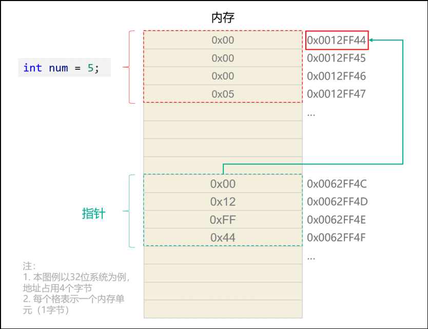
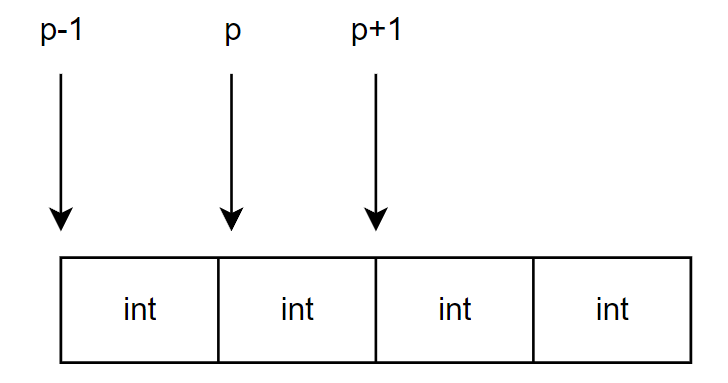
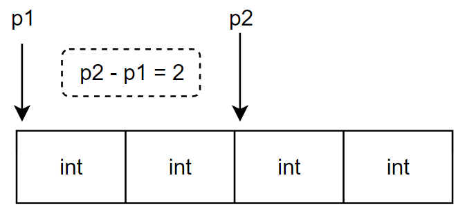

## 一、指针基础

变量有两种访问方式：

1. 直接访问，通过变量名访问
2. 间接访问，通过指针访问

### 1.什么是指针

用于专门存储地址的变量就是指针变量，通常简称指针。



> [!TIP]
>
> 64为系统使用64位表示地址，所以其指针占用8字节。
>
> 32位系统使用32位表示地址，其指针占用4字节。

### 2.指针的定义

一般格式：

```c
数据类型 *标识符 = 地址;
int *num = &a;
```

下面的写法都是合法的：

```c
int *num = &a;
int* num = &a;
int * num = &a;
```

### 3.&和*

- `&`为取地址运算符。
- `*`为取值运算符，作用是取出指针指向的内存地址处的数据值。

```c
int a = 1;
int *num = &a;
printf("%d", *num);
```

## 二、指针运算

### 1.指针加减

指针与整数加减表示指向的地址的位移对应的数据单位，移动多少与指针数据类型有关。

比如`int *p = &a;`，p+1表示地址加4，p-1表示地址减4。



### 2.同类型指针相减

同类型指针相减结果表示地址相差多少个数据单位。高位地址减去低位地址，返回的是正值；低位地址减去高位地址，返回的是负值。

同类型指针相减的结果是一个 ptrdiff_t 类型数据，ptrdiff_t 类型是一个带符号的整数，格式输出中对应的格式占位符是 %td



### 3.指针比较

指针比较是直接比较其指向地址的大小，返回的是int类型1或0。

## 三、指针和数组

### 1.数组名

==数组名在大多数情况下会隐式的转换为第一个元素的指针(唯独sizeof的时候不会转换)。==基本可以当成指针，具有指针的大部分特性。

> `arr[i]`是语法糖，本质就是 `*(arr+i)`的简写。

数组名和指针的区别：

1. 数组名表示符常量，不能改变；指针可以改变。
2. `sizeof 数组名`得到的是整个数组的大小; `sizeof 指针`得到的是指针的大小。

```c
#include <stdio.h>

int print(int arr[])//形参也为地址！
{
  printf("%zu\n", sizeof arr);//8
}
int main()
{
  int arr[3] = {1,2,3};
  int (*p)[3] = arr;

  printf("%zu\n", sizeof arr);//12
  printf("%p\n", arr);//地址
  printf("%p\n", p);//地址
  
  return 0;
}
```

### 2.指针数组

指针数组是一个数组，其每一个元素为指针。

```c
数据类型 *指针数组名[长度];
int *arr[3] = {&a,&b,&c};
```

### 3.数组指针

数组指针是一个指针，其指向一个数组的地址。注意，数组指针指向的是整个数组的地址而不是第一个元素的地址。

```c
数据类型 (*数组指针名)[长度];
int (*p)[3] = &arr;
```

上面的数组指针一个单位数据长度为12，所以p+1表示地址+12。

### 4.字符指针

字符指针变量（简称字符指针）是C语言中的一种指针类型，它用于指向字符或字符串（字符数组），通常用于处理字符串（字符数组）。

```c
char *pStr= "hello tom";
```

指向字符串字面量常量的字符指针的特点：

1. 相对于字符数组名，字符指针可以修改指针，指向新的字符串。
2. 不能通过下标修改某个字符。
3. 字符指针不能接收scanf输入的字符串。

### 总结：

```c
int arr[5] = {10,20,30,40,50};		// arr 数组名
int *ptr = arr;  					// ptr 显式定义的首元素指针
int (*arr_ptr)[5] = &arr;  			// arr_ptr 是数组指针
```

| 标识符  | 性质       | 数据类型   | sizeof 计算结果 | +1 的值              | * 取值（解引用）     | 能否重新赋值(可变性) |
| ------- | ---------- | ---------- | --------------- | -------------------- | -------------------- | -------------------- |
| arr     | 数组名     | int [5]    | 整个数组的大小  | 第二个元素地址       | 首元素值             | 否                   |
| ptr     | 首元素指针 | int *      | 地址大小        | 第二个元素地址       | 首元素值             | 是                   |
| arr_ptr | 数组指针   | int (*)[5] | 地址大小        | 数组后面地址（越界） | 数组名（首元素地址） | 是                   |

## 四、指针和函数

### 1.指针传递

- 传递非地址类型作为形参，实参会拷贝数据传递给形参，两个独立的数据。
- 传递地址类型作为形参，函数内修改地址对应的数据，外部也会修改。

> [!TIP]
>
> `void fn(int arr[]);`//arr为地址
>
> 函数参数为数组，其传递过来的形参为地址！

### 2.指针函数

函数的返回值是一个指针，这样的函数称为指针函数。

```c
char *strlong(char *str1, char *str2)
{
    if (strlen(str1) >= strlen(str2))
    {
        return str1;
    }
    else
    {
        return str2;
    }
}
```

> [!TIP]
>
> 指针函数返回的不能是局部变量的地址，因为其函数结束是就销毁。如需要可以返回静态局部变量的地址。

### 3.函数指针

是一个指针，指向一个函数。

函数名、&函数名、*函数名 都可以获取到函数代码的地址，都可以调用函数。

```c
返回类型 (*函数指针名)(参数列表);
int max()
{
    ...
}

int (*p)(int, int) = &max;
...
max();*max();&max();
p();*p();
```

### 4.回调函数

函数指针可以作为某个函数的参数来使用的，回调函数就是一个通过函数指针调用的函数。

```c
void initArray(int *array, int arraySize, int (*f)())
{
    for (int i = 0; i < arraySize; i++)
    {
        array[i] = f(); 
    }
}
int main()
{
    int myarray[10];
    // rand 是系统函数，会返回一个随机整数，位于 <stdlib.h> 标准库中
    initArray(myarray, 10, rand);
}
```

### 5. 指针常量/常量指针

- **指针常量**：即是指针，又是常量。表示指针定义后其值不能变。

  ```c
  int * const num = &a;
  ```

- **常量指针**：指向常量的指针。

  ```c
  const int *num = &b;//b可以不是常量，但通过num不能对其修改
  int const *num = &c;
  ```

## 五、多级指针

指向指针的指针。数组指针、二维数组都是多级指针。

```c
int *p = &num;
int **p2 = &p;
```

## 六、空指针

- 赋值为`NULL`值的指针称为空指针，NULL 是一个定义在标准库 <stdio.h>中的值为零的宏常量。
- 声明指针变量的时候，如果没有确切的地址赋值，为指针变量赋一个NULL 值是好的编程习惯。
- 空指针不能被解引用。

```c
int *p = NULL;
```

## 七、野指针

野指针就是指针指向的位置是不可知。

造成野指针的原因：

1. 悬空指针（指针没有初始化）
2. 指针越界
3. 指向已被释放的内存空间（函数调用结束销毁局部变量）

## 八、指针使用一览

| 变量定义     | 类型表示 | 含义                                     |
| ---------------------- | ------------------ | -------------------------------------------------- |
| int i        | int                | i是一个整型变量。                                  |
| int \*p      | int *              | p 是一个指向整型数据的指针                         |
| int a[5]     | int[5]             | a 是一个5个元素的整型数组。                        |
| int \*p[4]   | int *[4]           | p 是一个指针数组，每个元素都是指向整型数据的指针。 |
| int (\*p)[4] | int (*)[4]         | p 是一个数组指针，指向一个4个元素的整型数组。      |
| int f()      | int ()             | f是一个返回整型数据的函数                          |
| int \*f()    | int *()            | f是一个指针函数，返回指向整数数据的指针。          |
| int (\*p)()  | int (*)()          | p 是一个函数指针，指向一个返回整型数据的函数。     |
| int \*\*p    | int **             | p是一个指向指针的指针。                            |
