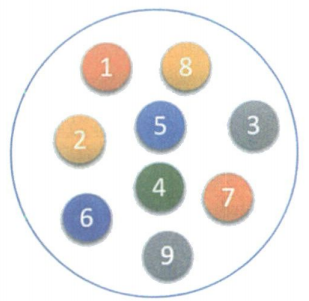
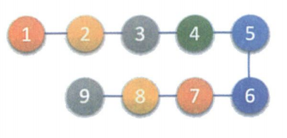
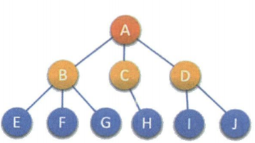
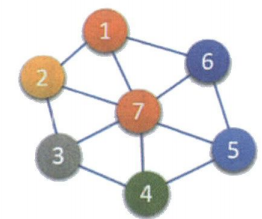
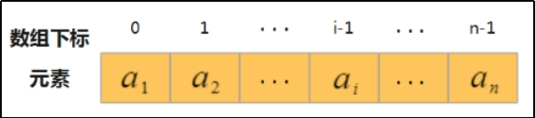
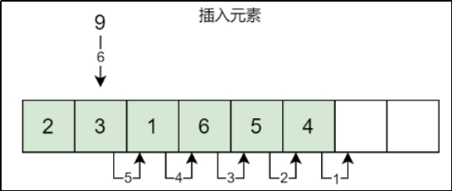
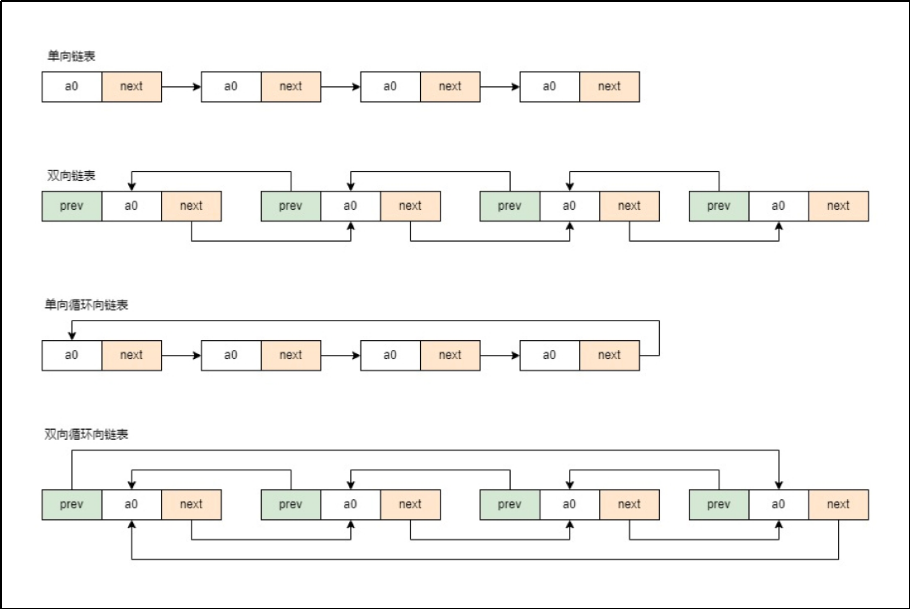

## 一、数据结构介绍

数据结构是相互之间存在一种或多种特定关系的数据元素的集合。

数据结构可以分为两种划分方式：

**逻辑结构：**

> 是指数据对象中数据元素之间的相互关系。

逻辑结构分为以下四种：

1. 集合结构：集合结构中的数据元素除了同属于一个集合外，它们之间没有具他关系。

   

2. 线性结构：线性结构中的数据元素之间是一对一的关系。

   

3. 树形结构：树形结构中的数据元素之间存在一种一对多的层次关系。

   

4. 图形结构：图形结构的数据元素是多对多的关系。

   

**物理结构：**

> 是指数据的逻辑结构在计算机中的存储形式。

数据元素的存储结构形式有两种：顺序存储和链式存储。

1. 顺序存储结构：是把数据元素存放在地址连续的存储单元里，其数据间的逻辑关系和物理关系是一致的。
2. 链式存储结构：是把数据元素存放在任意的存储单元里，这组存储单元可以是连续的，也可以是不连续的。

## 二、数组

### **优 点**

- 查找容易（通过下标），时间复杂度为O(1)。不需要额外申请或删除空间。

- 使用下标位置索引(index)十分高效的访问任意元素，修改快

 

### **缺 点**

- 插入、删除元素难，效率低。（需要移动大量元素以使元素空间连续）。

- 插入操作平均需要移动n/2个元素。

- 删除操作平均需要移动(n-1)/2个元素。

 

- 扩展相对繁琐。一方面需要确保能提供更大区域的连续内存空间，另一方面需要将原有数据复制到新的顺序表中。

### 实现可变数组

```c
#include <stdio.h>
#include <stdlib.h>

typedef int element_t;

typedef struct
{
  element_t *data;
  size_t capacity;
  size_t length;
} DynamicArray;

// 初始化动态数组
//  void initDynamicArray(DynamicArray *array, size_t initialCapacity);
DynamicArray *initDynamicArray(size_t initialCapacity);
// 释放动态数组内存
void destroyDynamicArray(DynamicArray *array);
// 调整动态数组内存大小
void resizeDynamicArray(DynamicArray *array, size_t newCapacity);
// 获取动态数组长度（元素个数）
size_t getLength(const DynamicArray *array);
// 在指定位置插入新元素
void insertAt(DynamicArray *array, size_t index, element_t element);
// 在末尾插入新元素
void insertEnd(DynamicArray *array, element_t element);
// 删除指定位置的元素并返回被删除的元素
int deleteAt(DynamicArray *array, size_t index);
// 删除末尾的元素并返回被删除的元素
int deleteEnd(DynamicArray *array);
// 遍历所有的元素
void print(DynamicArray *array);
int main()
{
  DynamicArray *dy = initDynamicArray(8);

  insertEnd(dy, 18);
  insertAt(dy, 1, 66);
  insertAt(dy, 1, 77);
  deleteEnd(dy);
  print(dy);

  destroyDynamicArray(dy);
  return 0;
}

DynamicArray *initDynamicArray(size_t initialCapacity)
{
  DynamicArray *dy = (DynamicArray *)malloc(sizeof(DynamicArray));

  dy->data = malloc(initialCapacity * sizeof(element_t));
  dy->capacity = initialCapacity;
  dy->length = 0;
  return dy;
}

void destroyDynamicArray(DynamicArray *array)
{
  free(array->data);
  free(array);
}

void resizeDynamicArray(DynamicArray *array, size_t newCapacity)
{
  array->data = (element_t *)(array->data, newCapacity * sizeof(element_t));
  array->capacity = newCapacity;
}

size_t getLength(const DynamicArray *array)
{
  return array->length;
}

void insertAt(DynamicArray *array, size_t index, element_t element)
{
  if (index > array->length)
  {
    return;
  }
  if (array->length == array->capacity)
  {
    resizeDynamicArray(array, array->capacity * 2);
  }
  for (int i = array->length; i > index; i--)
  {
    array->data[i] = array->data[i - 1];
  }
  array->data[index] = element;
  array->length++;
}

void insertEnd(DynamicArray *array, element_t element)
{
  insertAt(array, array->length, element);
}

int deleteAt(DynamicArray *array, size_t index)
{
  if (index > array->length - 1)
  {
    return -1;
  }
  element_t temp = array->data[index];
  for (int i = index; i < array->length - 1; i++)
  {
    array->data[i] = array->data[i + 1];
  }
  array->length--;
  return temp;
}

int deleteEnd(DynamicArray *array)
{
  return deleteAt(array, array->length - 1);
}

void print(DynamicArray *array)
{
  for (int i = 0; i < array->length; i++)
  {
    printf("%d ", array->data[i]);
  }
}
```

## 三、链表

### 介绍

**逻辑结构**：链表是一个线性结构，由一系列`结点(Node)`组成，每个结点包含一个数据元素和一个指向下一个结点的`指针(Pointer)`。所有结点通过指针相连，形成一个链式结构。通常我们将链表中的第一个结点称为`头结点`。

 

- data ：数据域，存放结点的值。

- next ：指针域，存放结点的直接后继的地址。

**物理结构**：与数组不同，链表中的结点需要自行组织，向系统申请很多分散在内存各处的结点，每个结点都保存了当前结点的数据和下一个结点的地址(指针)，通过指针将结点串成一串。


链表又分为单链表、双链表、循环单链表、循环双链表。



### **优点**

1. 插入和删除操作效率高。

2. 动态扩展性能更好，链表不需要像数组那样预先指定固定的大小，而是可以随时动态的增长或缩小。链表是真正的动态数据结构，不需要处理固定容量的问题。

### **缺点**

1. 查找慢。由于链表中的结点不是连续存储的，无法像数组一样根据索引直接计算出每个结点的地址。必须从头结点开始遍历链表，直到找到目标结点，这导致了链表的随机访问效率较低。

2. 额外的存储空间。链表的每个结点都需要存储指向下一个结点的指针，这会占用额外的存储空间。所以，相比于数组，链表需要更多的内存空间来存储相同数量的数据元素。

### 实现链表

```c
#include <stdio.h>
#include <stdlib.h>

typedef int element_t;

typedef struct Node
{
  element_t data;
  struct Node *next;
} Node;

typedef struct
{
  Node *head;
  size_t length;
} LinkedList;

// 初始化链表
LinkedList *initLinkedList();
// 返回链表的长度
size_t getLength(const LinkedList *list);
// 在指定位置插入元素
void insertAt(LinkedList *list, size_t index, element_t element);
// 在末尾插入元素
void insertEnd(LinkedList *list, element_t element);
// 删除指定位置的元素并返回被删除的元素
int deleteAt(LinkedList *list, size_t index);
// 删除末尾元素
int deleteEnd(LinkedList *list);
// 获取指定位置的元素
element_t getElementAt(const LinkedList *list, size_t index);
// 修改指定位置的元素
void modifyAt(LinkedList *list, size_t index, element_t newValue);
// 释放链表内存
void destroyLinkedList(LinkedList *list);

void print(LinkedList *list);
int main()
{
  LinkedList *list = initLinkedList();
  insertEnd(list, 11);
  insertEnd(list, 22);
  insertAt(list, 1, 33);
  deleteEnd(list);
  print(list);
  modifyAt(list,1,66);
  print(list);

  destroyLinkedList(list);
  return 0;
}

LinkedList *initLinkedList()
{
  LinkedList *linkedList = (LinkedList *)malloc(sizeof(LinkedList));
  linkedList->head = NULL;
  linkedList->length = 0;
  return linkedList;
}

void destroyLinkedList(LinkedList *list)
{
  Node *current = list->head;
  while (current != NULL)
  {
    Node *free_node = current;
    current = current->next;
    free(free_node);
  }
  free(list);
}

void print(LinkedList *list)
{
  if (list->length == 0)
  {
    return;
  }
  Node *current = list->head;
  while (current->next != NULL)
  {
    printf("%d ", current->data);
    current = current->next;
  }
  printf("%d\n", current->data);
}

size_t getLength(const LinkedList *list)
{
  return list->length;
}

void insertAt(LinkedList *list, size_t index, element_t element)
{
  if (index > list->length)
  {
    return;
  }
  Node *new_node = (Node *)malloc(sizeof(Node));
  new_node->data = element;
  if (index == 0)
  {
    new_node->next = list->head;
    list->head = new_node;
  }
  else
  {
    Node *current = list->head;
    for (int i = 1; i < index; i++)
    {
      current = current->next;
    }
    new_node->next = current->next;
    current->next = new_node;
  }
  list->length++;
}

void insertEnd(LinkedList *list, element_t element)
{
  insertAt(list, list->length, element);
}

int deleteAt(LinkedList *list, size_t index)
{
  if (index > list->length - 1)
  {
    return -1;
  }
  Node *current = list->head;
  if (index == 0)
  {
    list->head = current->next;
    free(current);
  }
  else
  {
    for (int i = 0; i < index - 1; i++)
    {
      current = current->next;
    }
    current->next = current->next->next;
    free(current->next);
  }
  list->length--;
  return 1;
}

int deleteEnd(LinkedList *list)
{
  return deleteAt(list, list->length - 1);
}

element_t getElementAt(const LinkedList *list, size_t index)
{
  if (index > list->length - 1)
  {
    return -1;
  }
  Node *current = list->head;
  if (index == 0)
  {
    return current->data;
  }
  else
  {
    for (int i = 0; i < index; i++)
    {
      current = current->next;
    }
    return current->data;
  }
}

void modifyAt(LinkedList *list, size_t index, element_t newValue)
{
  if (index > list->length - 1)
  {
    return;
  }
  Node *current = list->head;
  if (index == 0)
  {
    current->data = newValue;
  }
  else
  {
    for (int i = 0; i < index; i++)
    {
      current = current->next;
    }
    current->data = newValue;
  }
}
```

## 四、栈

栈(stack)，是限制在只能在表的一端进行插入和删除操作的线性表。先进后出

```c
#include <stdio.h>
#include <stdlib.h>

// 栈结构
typedef struct
{
    int *data;       // 动态数组存储栈元素
    size_t size;     // 栈内元素个数
    size_t capacity; // 动态数组的容量
} Stack;

// 初始化栈
void initStack(Stack *stack, size_t capacity)
{
    stack->data = (int *)malloc(capacity * sizeof(int)); // 分配初始容量的内存
    stack->size = 0;                                     // 初始元素个数为0
    stack->capacity = capacity;                          // 设置容量
}

// 返回栈内元素个数
size_t getSize(const Stack *stack)
{
    return stack->size;
}

// 添加新元素
void push(Stack *stack, int element)
{
    if (stack->size == stack->capacity)
    {
        // 如果栈已满，需要扩展容量
        stack->capacity *= 2;
        stack->data = (int *)realloc(stack->data, stack->capacity * sizeof(int));
    }
    stack->data[stack->size] = element; // 将元素压入栈顶
    stack->size++;                      // 更新元素个数
}

// 栈顶元素出栈并返回
int pop(Stack *stack)
{
    if (stack->size == 0)
    {
        return -1; // 栈为空，返回无效值
    }
    stack->size--;                   // 更新元素个数
    return stack->data[stack->size]; // 返回栈顶元素
}

// 释放栈内存
void destroyStack(Stack *stack)
{
    free(stack->data); // 释放动态数组内存
    stack->data = NULL;
    stack->size = 0;
    stack->capacity = 0;
}
```


## 五、队列

队列(Queue)：也是操作受限的线性表，限制为仅允许在表的一端进行插入(入队或进队），在表的另一端进行删除(出队或离队)操作。先进先出

```c
#include <stdio.h>
#include <stdlib.h>
#include <stdbool.h>

typedef int element_t;

typedef struct
{
  element_t *data;
  size_t capacity;
  size_t length;
  size_t front;
  size_t rear;
} Queue;

// 队列初始化
void initQueue(Queue *qu, size_t size)
{
  qu->data = (element_t *)malloc(sizeof(element_t) * size);
  qu->capacity = size;
  qu->length = 0;
  qu->front = 0;
  qu->rear = 0;
}

// 销毁队列
void destoryQueue(Queue *qu)
{
  free(qu);
  qu->data = NULL;
  qu->capacity = 0;
  qu->length = 0;
  qu->front = 0;
  qu->rear = 0;
}

// 加入队列
bool add(Queue *qu, element_t element)
{
  if (qu->length == qu->capacity)
  {
    return false;
  }
  int index = qu->rear;
  qu->data[index] = element;
  qu->rear = (qu->rear + 1) % (qu->capacity);
  qu->length++;
  return true;
}

// 移除队列
bool del(Queue *qu)
{
  if (qu->length == 0)
  {
    return false;
  }
  qu->front = (qu->front + 1) % (qu->capacity);
  qu->length--;
  return true;
}

// 打印队列
void print(Queue *qu)
{
  for (int i = 0; i < qu->length; i++)
  {
    int index = qu->front + i % qu->capacity;
    printf("%d ", qu->data[index]);
  }
  printf("\n");
}

int main()
{
  Queue qu;
  initQueue(&qu, 6);
  add(&qu, 100);
  add(&qu, 200);
  print(&qu);
  del(&qu);
  print(&qu);

  return 0;
}
```

