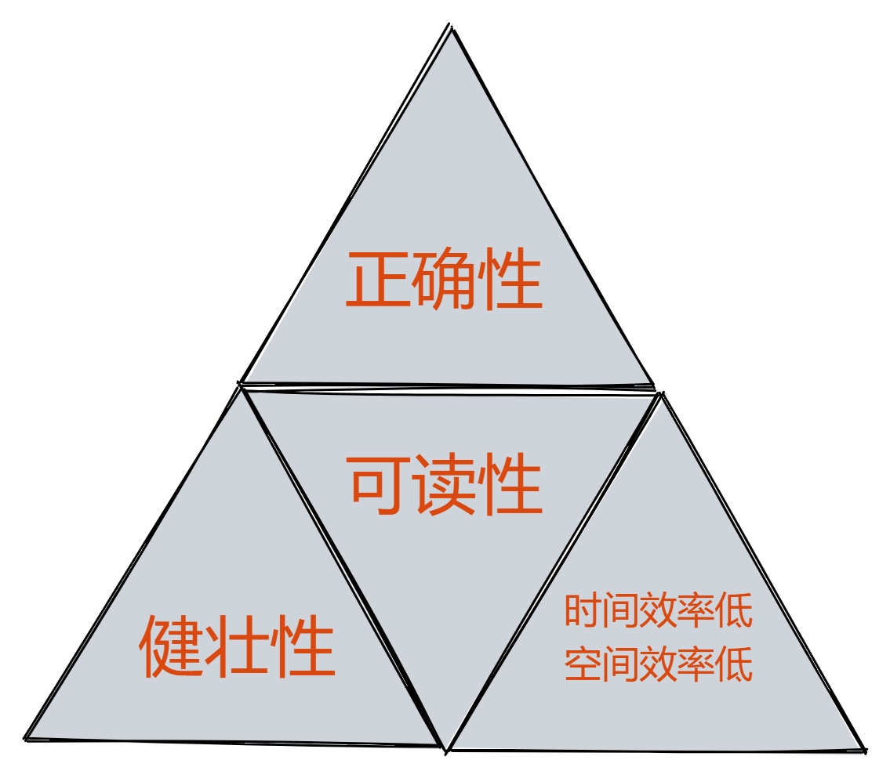

## 一、算法介绍

### 算法定义

算法是解决特定问题求解步骤的描述，在计算机中表现为指令的有限序列，并且每个指令表示一个或多个操作。

### 算法特征

算法有五个特征：输入、输出、有穷性、确定性、可行性。


1. **输入输出**：算法有零个或多个输入；算法至少有一个或多个输出。
2. **有穷性**：指算法在执行有限的步骤之后，自动结束而不会出现无限循环，并且每一个步骤在可接受的时间内完成。
3. **确定性**：算法的每一步骤都具有确定的含义，不会出现二义性。
4. **可行性**：算法的每一步都必须是可行的，也就是说，每一步都能够通过执行有限次数完成。

### 算法设计的要求



1. **正确性**：算法的正确性是指算法至少应该具有输入和输出和加工处理无歧义性，能正确反映问题的需求，能够得到问题的正确答案。

   但是算法的“正确”通常在用法上有很大的差别，大体分为以下四个层次。 
   （1）算法程序没有语法错误。
   （2）算法程序对于合法的输入数据能够产生满足要求的输出结果。
   （3）算法程序对于非法的输入数据能够得出满足规格说明的结果。
   （4）算法程序对于精心选择的,甚至刁难的测试数据都有满足要求的输出结果。

   一般情况下我们吧（3）作为一个算法是否正确的标准

2. **可读性：**算法设计的另一目的是为了便于阅读、理解和交流。

3. **健壮性：**输入数据不合法时，算法也能做出相关处理，而不是产生异常或莫名其妙的结果。

4. **时间效率高和存储量低：**设计算法应该尽量满足时间效率高和存储量低的需求。

### 算法效率

**常见的时间复杂度：**

`O(1)  <  O(log n)  <  O(n)  <  O(nlogn)  <  O(n^2)  <  O(2ⁿ)  <  O(n!)`


**算法空间复杂度：**

算法的空间复杂度通过计算算法所需的存储空间实现，算法空间复杂度的计算公式记作：S(n)= O(f(n))，其中，n为问题的规模，f(n)为语句关于n所占存储空间的函数。

## 二、查找算法

### ① 顺序查找

- 概述：顺序查找又称线性查找，遍历元素依次与目标值比较。
- 时间复杂度： 最优O(1)、最高O(n)、平均O(n/2)
- 空间复杂度： O(1)


### ② 二分查找

- 概述：其原理是通过将数据集划分为两半并与目标进行比较，以确定目标在哪一半中，从而逐步缩小搜索范围，直到找到目标元素或确定不存在。
- 优缺点： 时间复杂度较低； 必须是有序的数据集合。
- 时间复杂度： O(logn)
- 空间复杂度： O(1)

```c
int binarySearch(int arr[], int length, int target)
{
	int start = 0;
	int end = length - 1;

	while (start <= end)
	{
		int mid = (start + end) / 2;
		if (target == arr[mid])
		{
			return mid;
		}
		else if (target < arr[mid])
		{
			end = mid - 1;
			continue;
		}
		else if (target > arr[mid])
		{
			start = mid + 1;
			continue;
		}
	}
	return -1;
}
```

## 三、排序算法

### ① 冒泡排序

- 时间复杂度： O(n²)
- 空间复杂度： O(1)

```c
void bubbleSort(int *arr, int length)
{
	for (int i = 0; i < length - 1; i++)
	{
		for (int j = 0; j < length - i - 1; j++)
		{
			if (arr[j] > arr[j + 1])
			{
				int temp = arr[j];
				arr[j] = arr[j + 1];
				arr[j + 1] = temp;
			}
		}
	}
}
```


### ② 快速排序

- 时间复杂度：O(nlogn)
- 空间复杂度：O(nlogn)

```c
void quickSort(int *arr, int start, int end)
{
	if (start >= end)
	{
		return;
	}
	int base = arr[0];
	int low = start;
	int high = end + 1;

	while (1)
	{
		while (low < high)
		{
			low++;
			if (arr[low] > base)
			{
				break;
			}
		}
		while (high > start)
		{
			high--;
			if (arr[high] < base)
			{
				break;
			}
		}
		if (low < high)
		{
			int temp = arr[low];
			arr[low] = arr[high];
			arr[high] = temp;
		}
		else
		{
			int temp = arr[start];
			arr[start] = arr[high];
			arr[high] = temp;
			break;
		}
	}
	quickSort(arr, start, high - 1);
	quickSort(arr, high + 1, end);
}
```

