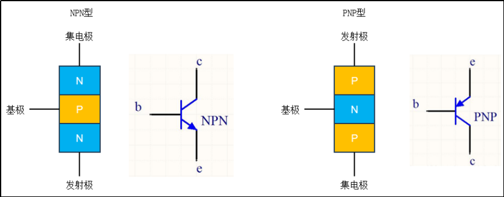
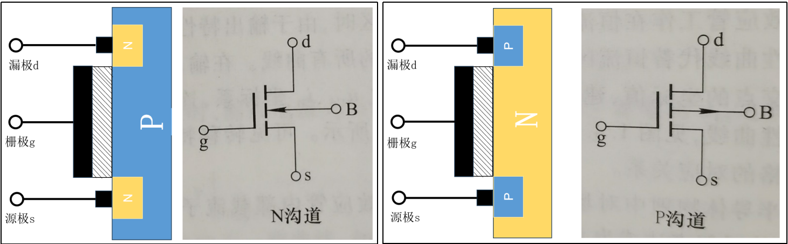

## 电学

#### 1. 交流电和直流电

```
直流电： 电流方向和大小不随时间变化，英文简称：DC
交流电： 电流方向和小小随时间做周期性变化，英文简称：AC
```

#### 2. 安全电压、强电和弱点

```
安全电压：交流36V以下、直流24V以下。
强电：用于提供能量
弱电：用于传递信号
```

## 模拟电路和半导体元器件

### 3.1 二极管

#### ① 原理

```
N型半导体和P型半导体中间形成势垒，称为PN结； 突破势垒即可导通，P接正极，N接负极，可以导通。
```

```
N 型半导体： 掺杂了磷原子的硅晶体称为N型半导体，带负电。
P 型半导体： 掺杂了硼原子的硅晶体称为P型半导体，带正电。
```

#### ② 特点和功能

```
单向导通
```

#### ③ LED

```
1. LED
2. 数码管
3. 点阵屏
```

### 3.2 晶体管（三极管）



#### ① 组成

```
基极 b
集电极 c
发射极 e
```

```
NPN型： 给基极高电平导通，电流从集电极、基极到发射极。
PNP型： 给基极低电平导通，电流发射极到集电极、基极。
```

> 符号中的箭头表示电流方向！

#### ② 功能

```
1. 开关（小电流控制大电流）
2. 放大信号
```

### 3.3 场效应管（mos管）



#### ① 组成

```
栅极g
漏极d
源极s
```

```
N沟道（NMOS）： 给栅极高电平，电流方向从漏极到源极
P沟道（PMOS）： 给栅极低电平，电流方向从源极到漏极
```

> 符号中的箭头是电子的受力方向！

#### ② 功能

```
开关
```
