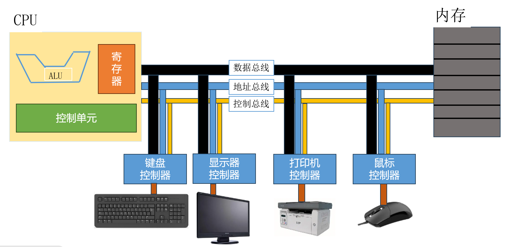
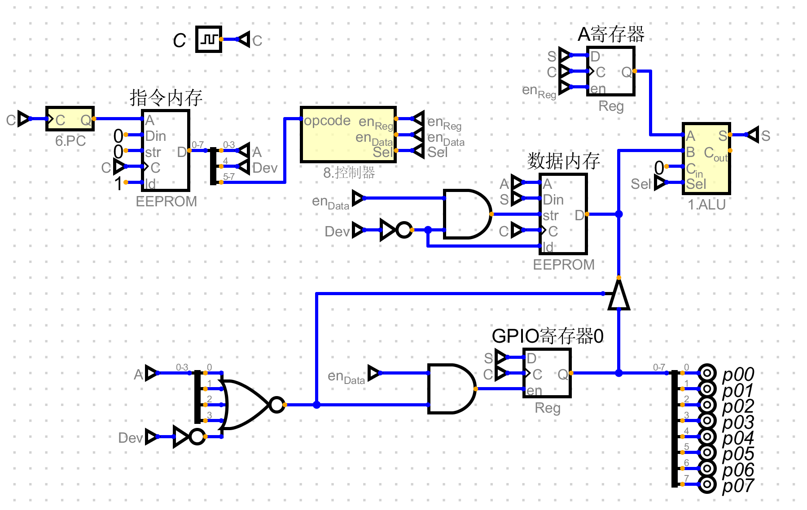

## 一、冯诺依曼模型的计算机

​	由科学家冯诺依曼提出的模型理论。基于通用图灵机建造的计算机都是在存储器（内存/寄存器）上存储数据。鉴于程序和数据在逻辑上是相同的，因此程序也能存储在计算机的存储器中。

### 1.冯诺依曼模型的四个子系统

1. **存储器:**用来存储数据和程序的区域。
2. **算术逻辑单元（ALU）:**用来进行计算（算术运算、逻辑运算、位运算）的地方。
3. **控制单元（CU）:**对存储器、算术逻辑单元、输入\输出单元进行控制。
4. **输入\输出单元:**输入单元负责从计算机外部接收输入数据，输出单元负责将计算机处理结果输出到计算机外部。

### 2.冯诺依曼模型-存储程序概念

​	冯诺依曼中的程序是由一组数量有限的指令组成。冯诺依曼模型要求程序也必须存储在存储器(内存)中，现代计算机的存储单元用来存储程序和数据，这意味着程序和数据应该有相同的格式，实际上他们都是以位模式（0和1）存储在内存中。

### 3.冯诺依曼模型-指令的顺序执行

控制单元从内存中提取一条指令，解释指令，接着执行指令，也就是说指令是一条接着一条顺序执行的。

## 二、计算机组成部件

计算机组成部件可以分为三大类。

（1）中央处理单元（CPU）

（2）主存储器（内存）

（3）输入/输出子系统

### 1.中央处理单元（CPU）

CPU用于数据的运算【算数逻辑单元（ALU）、控制单元、寄存器组】。

#### ALU

1. 算术运算
2. 位移运算
3. 逻辑运算

#### 寄存器

1. 数据存储寄存器

2. 指令存储器（IR）

3. 程序计数器（PC）：

   保存当前正在执行的指令地址，当前指令执行完成后，计数器自动加1，指向下一条指令的内存地址。

#### CPU控制单元

控制单元：控制各个子系统的操作

### 2.内存

内存是存储单元的集合，每个存储单元都有唯一的标识，称为地址。

主要有两种类型：RAM和ROM。

1. 随机存取存储器（RAM）

   特点：系统断电后，信息（程序或数据）丢失。

2. 只读存储器（ROM）

   特点：系统断电数据不会丢失。常用来存储那些在开机时运行的程序。

> 内存与cpu链接：
>
> ​	CPU与主存储器之间通常由称为总线的三组线路进行连接。他们分别是：
>
> ​	数据总线、地址总线、控制总线。

### 3.输入输出系统

可以使计算机与外界进行通信，并在断电情况下存储程序和数据，分为两大类：非存储设备和存储设备。

1. 非存储设备：键盘、鼠标、显示器、打印机等。

2. 存储设备：也称为辅助存储设备，通常有磁介质和光介质两种，还有现代的固态硬盘。

> 输入/输出设备不能直接与CPU和内存的总线相连接，需要输入输出控制器作为中介链接到cpu和内存的总线上。

### 4.不同指令集体系结构

#### CISC（复杂指令集计算机）体系结构

- 设计策略：是使用大量的指令，包括复杂指令。

- 优点：程序设计更容易，因为每个简单或复杂的任务都有一条对应的指令。程序员不需要写一大堆的指令去完成复杂的任务。

- 缺点：指令集的复杂性使得CPU和控制单元电路非常复杂。

#### RISC （精简指令集计算机）体系结构

- 设计策略：是使用少量的指令完成最少的简单操作。

- 缺点：程序设计更难，复杂指令需要用简单指令模拟。

## 三、实现简单单片机

