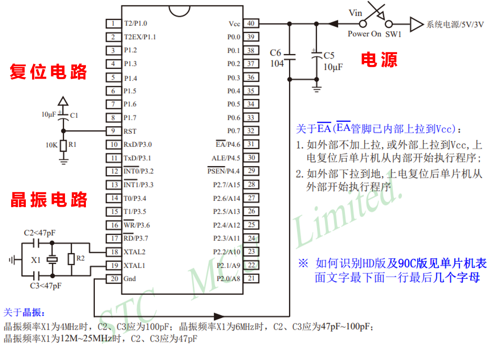
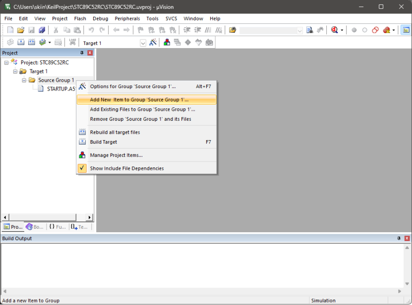
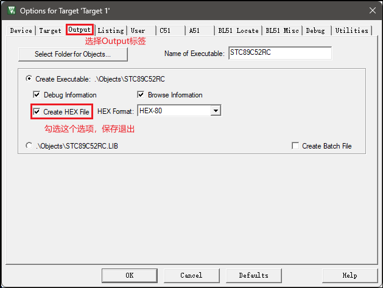

# 一、单片机概述

## 1.单片机介绍

​	单片机是一种将中央处理器（CPU）、存储器、输入/输出接口等集成在一个芯片上的微型计算机。它具有体积小、价格便宜、易于编程等特点，广泛应用于家用电器的智能控制模块，无人售卖系统、医疗设备中的监测系统等。 

​	51单片机（或称8051单片机）原是指1980年由Intel公司推出的一种8位微控制器系列，现在更多的指实现了8051指令集（单片机的“语言”）的一系列单片机。

## 2.最小系统

单片机最小系统的三要素为：电源、晶振和复位电路



## 3.STC89C52RC

STC89C52RC系列命名规则


# 二、开发环境

## 1.Keil软件开发环境

51单片机的软件开发环境需要具备代码编辑、代码编译、程序烧录等功能，典型的软件开发环境如下。

- Keil是一个运行在Windows系统中的单片机集成开发环境（Integrated Development Environment），其提供了代码编辑、代码编译、仿真和调试等功能。
- Keil C51 Compiler是一个专门用于51单片机的C语言编译器，Keil中集成了该编译器。 
- STC-ISP是STC公司专门为STC芯片提供的程序烧录工具，用于将程序写入单片机。

Keil下载地址：https://www.keil.com/download/product/

STC-ISP下载地址：https://www.stcmicro.com/rjxz.html

#### ①向Keil添加STC89C52系列芯片信息


需要选择Keil的安装目录，选择后点击确定即可。


#### ②创建项目


#### ③编写程序



```c
#include <STC89C5xRC.H> //包含STC89C52的头文件

void main()
{
    // 让P00引脚输出低电平
    P00 = 0;
    // 死循环卡住单片机，让它不要继续往下执行
    while (1);
}
```

#### ④构建项目





#### ⑤烧录程序

将开发板通过数据线与PC相连。


## 2.VSCode环境

### ①EIDE插件

下载VSCode并安装EIDE插件。


### ②配置

- 配置编译器


- 配置头文件


- 配置烧录

1. 安装python环境

2. 在命令行安装

   ```
   pip install pyserial -i https://pypi.tuna.tsinghua.edu.cn/simple
   pip install stcgal -i https://pypi.tuna.tsinghua.edu.cn/simple
   ```

3. 烧录配置选择`stcgal`

