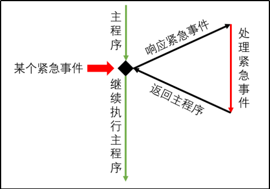

# 中断系统

## 一、概述

​	中断系统是单片机用于处理外部紧急事件得一种机制。外部发生紧急事件，CPU会暂停当前得工作，转而chuli这个紧急事件，处理完成后再回到原来被中断得位置继续执行。



- **中断源**

  指能够引起中断得事件。

  1. 外部中断
  2. 定时器中断
  3. 串口中断

- **中断标志位**

  标志中断是否发生，发生中断置为1。中断结束需要复位，有些中断源的标志位能自动复位，有些需要手动复位。

- **中断服务程序**

  中断服务程序指处理中断的逻辑，当某个中断标志位置1时，CPU会自动执行相应的中断服务程序。

- **中断优先级**

  多个中断同时发生时，中断的执行顺序，并且高优先级会打断低优先级的中断。

## 二、外部中断

1. 启动中断
2. 配置中断触发方式
3. 配置优先级
4. 定义中断服务程序

## 三、定时器中断

1. 启动中断
2. 配置中断工作模式
3. 配置脉冲计数初始值
4. 启动定时器
5. 定义中断服务程序

## 四、串口中断

串口中断是由单片机串口触发的中断。

串口是单片机用于收发数据的重要接口之一，当单片机通过串口接收到数据或者发送完数据后都会触发相应的中断。

## 附录

### 寄存器名称

**IE：**Interrupt Enable，中断允许寄存器。

**XICON：**Auxiliary Interrupt Control，辅助中断控制寄存器。  

**TCON：** Timer/Counter 0 and 1 Control，定时器/计数器中断控制寄存器。  

**T2CON：**Timer/Counter 2 Control，定时器/计数器2控制寄存器。  

**SCON：** Serial Control，串口控制寄存器。

**IP：**Interrupt Priority Low，中断优先级控制寄存器（低位）。

**IPH：**Interrupt Priority High，中断优先级控制寄存器（高位）。

**TMOD：**Timer Mode，定时器模式寄存器。  

### 中断相关单词

```
interrupt：中断
enable: 允许
external：外部
timer：定时器
serial：串行
Auxiliary： 辅助
control：控制
priority：优先级
trigger：触发
```

