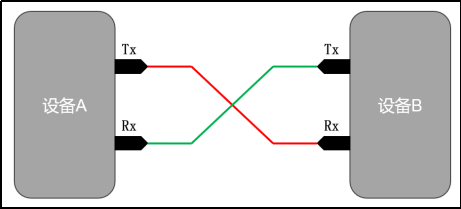
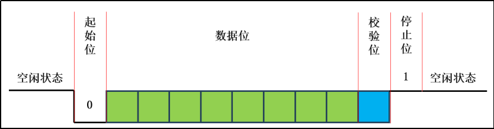

# 一、通讯术语

## 1.串行和并行

- 串行通讯是通过一位数据逐位传输。
- 并行通讯是多位数据同时传输。

|                | **串行** | **并行** |
| -------------- | -------- | -------- |
| **传输速率**   | 低       | 高       |
| **硬件成本**   | 低       | 高       |
| **抗干扰能力** | 高       | 低       |
| **通讯距离**   | 高       | 低       |

## 2.单工和双工通讯

- 单工通讯：只能一个方向传输数据
- 双工通讯：允许两个方向都可以传输数据
  - 半双工通讯：允许两个方向都可以传输数据，但不能同时进行。
  - 全双工通讯：允许两个方向都可以传输数据，且能同时进行。

## 3.同步和异步

- 同步通讯需要时钟信号线，进行同频通讯。
- 异步通讯不用时钟信号线，频率不一定一致。

# 二、UART通信

## 1.介绍

### ①概述

​	UART（Universal Asynchronous Receiver/Transmitter）是一种异步、全双工的串行通信接口，常用于微控制器与计算机、其他微控制器或外部设备之间的数据交换，下图是UART通信所需的信号线，其中Tx用于发送数据，Rx用于接受数据。



### ②数据格式



- **空闲位**

  协议规定，在空闲状态下，也就是没有数据传输时，应为高电平。

- **起始位**

  起始位表示一个数据帧的开始，起始位为低电平。

- **数据位**

  传输的主体内容，位于起始位之后，长度可以是5到9位，一般都是8位。

- **校验位**

  校验当前帧的正确性，校验算法可以是奇校验或偶校验

  - 奇校验（odd parity）：如果（数据位+校验位）中1的数目是奇数，则校验位为1
  - 偶校验（odd parity）：如果（数据位+校验位）中1的数目是偶数，则校验位为1

- **停止位**

  停止位表示数据帧的结束，通常为1位或2位，停止位为高电平。

### ③双方约定

- 波特率

  表示数据的传输速率

- 数据位

- 校验位

- 停止位

## 2.UART使用步骤

- 配置串口模式
- 配置波特率
  - 设置定时器模式：8位重装载
  - 设置定时器初始值
  - 开启定时器
- 配置接收
  - 开启接收
  - 配置是否检查停止位
- 配置串口中断
  - 开启串口中断
  - 定义串口中断服务程序

```c
#include "Dri_UART.h"

// 定义变量保存接收到的一字节的数据
// static char s_received_byte = 0;

// 定义变量 标记是否接收完一个字节的数据 1表示已接收完
static bit s_is_received_byte = 0;
// 定义变量 标记是否发送完一个字节的数据 1表示已发完，0表示正在发送
static bit s_is_transmited_byte = 1;

// 定义字符数组，保存接收到多字节数据
static char s_received_bytes[10];
// 定义变量，标记多个字节数据是否接收完成
static bit s_is_received_bytes = 0;
// 定义变量，记录字符数组要添加的位置下标
static u8 s_index = 0;

/**
 * @brief UART 初始化
 *
 */
void Dri_UART_Init()
{
    // 1. 工作模式 -----------------------------------------------------------
    // 设置位工作模式1,8位UART，无校验位，波特率可配置
    SM0 = 0;
    SM1 = 1;

    // 2. 设置波特率、配置定时器1 ------------------------------------------------------------------
    // 设置为 9600 波特率

    // 2.1 设置是否2分频，设置为0，PCON & 01111111
    PCON &= 0x7F;

    // 2.2 设置定时器1的工作模式，设置成模式2,8位自动重装载
    TMOD &= 0x0F; // 将高4位全置为0， TMOD & 0b00001111
    TMOD |= 0x20; // 将高4位设置为 0010, TMOD | 0b0010 0000, CATE=0,C/T=0,M1M0=10

    // 2.3 计算并设置定时器1的起始值
    /*
        溢出率=9600*32;

        每次计数脉冲时间: 1/11059200 × 12  合： 12/11059200
        溢出一次的时间： 1/溢出率 合：1/(9600*32)
        溢出一次需要多少个计数脉冲：   溢出一次的时间/每次计数脉冲时间  合： 1/(9600*32) / (12/11059200)
        计算脉冲计数器起始值： 最大值 - 溢出一次需要的计数脉冲  合 256 - 1/(9600*32) / (12/11059200)
    */
    TH1 = 253; // TH1寄存器存储起始值
    TL1 = 253; // TL1寄存器用作计数

    // 2.4 定时器1开始计数
    TR1 = 1;

    // 3. 接收相关配置 --------------------------------------------------------------------------
    // 3.1 允许接收数据
    REN = 1;
    // 3.2 不检测停止位
    SM2 = 0;

    // 4. 串口中断配置  --------------------------------------------------------------------------
    // 4.1 打开中断总开关
    EA = 1;
    // 4.2 打开串口中断开关
    ES = 1;
}

/**
 * @brief 接收单个字节数据
 *
 * @param ch 将接收到的单字节数据存入该地址
 * @return bit 1表示接收成功 0表示接收失败
 */
bit Dri_UART_ReceiveChar(char *ch)
{
    if (s_is_received_byte)
    {
        *ch = SBUF;
        s_is_received_byte = 0;
        return 1;
    }

    return 0;
}

/**
 * @brief 接收多个字节数据（多字节指令），换行作为指令结束符
 * 
 * @param str 将接收到的多个字节的数据存入该字符串中
 * @return bit 1表示接收成功 0表示接收失败
 */
bit Dri_UART_ReceiveStr(char *str)
{
    u8 i;
    // 判断多字节指令是否接收完毕
    if (s_is_received_bytes)
    {
        // 遍历字符数组
        for (i = 0; i < s_index; i++)
        {
            str[i] = s_received_bytes[i];
        }
        // 添加字符串结束标记
        str[i] = '\0';

        // 重置标记
        s_is_received_bytes = 0;
        s_index = 0;

        return 1;
    }
    return 0;
}

/**
 * @brief 发送单个字节数据
 *
 * @param ch 要发送的数据
 */
void Dri_UART_TransmitChar(char ch)
{
    // 等待上次发送完成
    while (s_is_transmited_byte == 0)
        ;

    // 给发送缓冲器赋值，发送控制器就会自动发送
    SBUF = ch;
    // 标记正在发送
    s_is_transmited_byte = 0;
}

/**
 * @brief 发送多个字节的数据
 * 
 * @param str 要发送的字符串
 */
void Dri_UART_TransmitStr(char *str)
{
    // 取到字符串结束标记，循环停止
    while (*str != '\0')
    {
        Dri_UART_TransmitChar(*str); // 发送当前指向的字符
        str++;  // 指针后移
    }
}

// 串口中断服务程序
void Dri_UART_Handler() interrupt 4
{
    // 发送完一帧数据触发的中断
    if (TI == 1)
    {   
        // 标记已经发送完成
        s_is_transmited_byte = 1;
        // 将标志位置0
        TI = 0;
    }

    // 接收完一帧数据触发的中断
    if (RI == 1)
    {
        if (SBUF != '\n')
        {
            s_received_bytes[s_index] = SBUF;
            s_index++;
        }
        else
        {
            s_is_received_bytes = 1;        // 标志该多字节指令接收完毕
        }

        s_is_received_byte = 1;
        // 将标志位置0
        RI = 0;
    }
}
```

