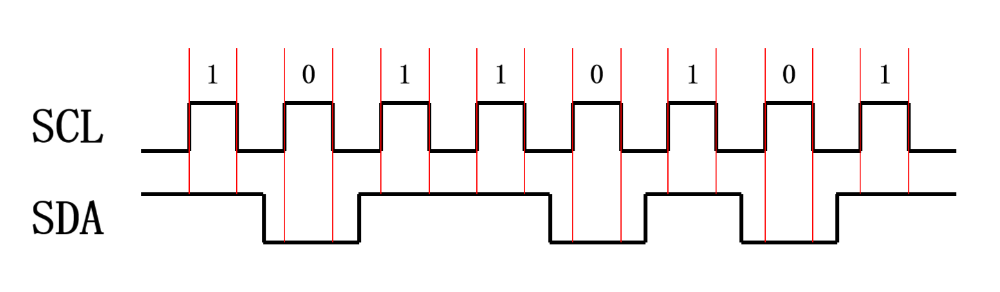
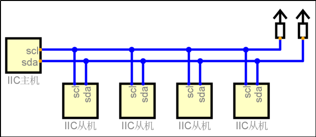
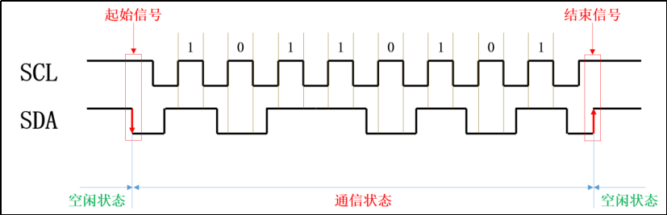
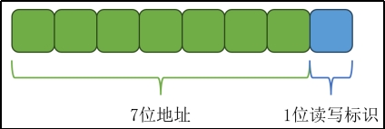
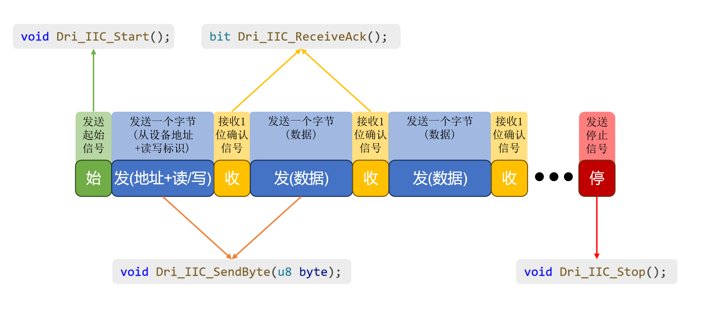
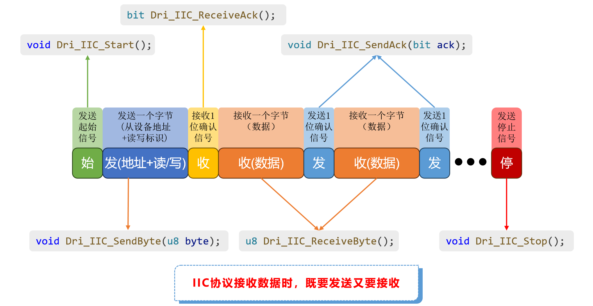

# IIC

## 一、概述

​	I^2^C（Inter-Integrated Circuit），通常简称为IIC，是一种用在集成电路（IC）之间的串行通信总线。它是由Philips（现在的NXP半导体）在上世纪80年代开发的，并在之后广泛应用于各种电子设备和嵌入式系统中。

### 信号线

​	I^2^C是**同步串行**通信，使用一根数据线（SDA）和一根时钟线（SCL）进行通信，每个时钟周期SDA传输一位数据。

​	I^2^C规定，数据的接收方在每个周期的**高电平期间读取数据**，也就是SCL位高电平时，读取SDA数据线上的数据。



### 主从架构

​	I^2^C采用主从架构，一个主设备连接多个从设备。主设备负责发起通信和控制总线，而从设备负责响应主设备的请求。



​	每个设备都有一个唯一地址（7位），主设备根据地址选择与谁进行通信。

## 二、通信协议

### 1.空闲状态

​	I2C协议规定，当SDA和SCL均为高电平时，总线为空闲状态。

### 2.起始和结束信号

​	主从设备每次通信都需要有一个起始信号开始和一个结束信号终止。

​	**起始信号：**空闲状态时（SCL高电平），SDA由高变低↓

​	**结束信号：**空闲状态时，SDA由低变高↑



### 3.确认信号

​	I^2^C协议规定，发送方每发送一个字节（8位）的数据，接收方都要回复一个1位的确认信号。

- 确认信号为0表示接收方成功接收，这个信号在I2C协议中称为ACK （Acknowledge）

- 确认信号为1表示接收方接收失败，称为NACK（Not Acknowledge）

### 4.从机地址和读写标识

​	一个I2C总线上可能有多个从设备，所以开始通信前，主设备需要先与目标设备取得联系，然后再进行数据传输。

​	当主设备发送起始信号之后，会向所有设备发送一个字节的数据，这一个字节中，前7位为目标设备地址，第8位为读/写标识（1表示读，0表示写），如下图所示。

 

​	当各从设备收到这个字节的数据后，会将7位地址与自身进行对比，相同则会向主设备回复确认信号，不相同则不做任何回应。

​	当主设备收到目标设备的确认信号后，便会开始与该设备进行通信。

## 三、编写驱动

### 总体流程

（1）发送起始信号

（2）发送目标从设备地址+读写标识位

（3）接收从设备回复的确认信号

（4）与从设备进行数据传输（发送/接收）

（5）发送终止信号

- 使用IIC协议发送数据的时序图：

  

- 使用IIC协议接收数据的时序图：

  

### 代码实现

```c
#include "Dri_IIC.h"

/**
 * @brief 发送起始信号
 *
 */
void Dri_IIC_Start()
{
    // 确保是空闲状态
    SCL = 1;
    SDA = 1;

    // 将SDA拉低，发送起始信号
    SDA = 0;

    // 拉低时钟，方便下一步操作
    SCL = 0;
}

/**
 * @brief 发送一个字节的数据
 *
 * @param byte 要发送的数据
 */
void Dri_IIC_SendByte(u8 byte)
{
    /*
        第一次发送（最高位）：  (byte & 0b10000000) == 0 ? 0 : 1
        第二次发送（次高位）：  (byte & 0b01000000) == 0 ? 0 : 1
        第三次发送（第三高位）：  (byte & 0b0010000) == 0 ? 0 : 1
        ...
        最后一次发送(最低位)：(byte & 0b0000001) == 0 ? 0 : 1
    */
    u8 i;
    for (i = 0; i < 8; i++)
    {
        SDA = (byte & (0x80 >> i)) == 0 ? 0 : 1;
        SCL = 1;
        SCL = 0;
    }
}

/**
 * @brief 接收确认信号
 *
 * @return bit 返回接收到确认信号
 */
bit Dri_IIC_ReceiveACK()
{
    bit ack;

    // 主设备释放SDA（将其拉高）
    SDA = 1;

    // 主设备读取SDA
    SCL = 1;
    ack = SDA;

    // 拉低SCL
    SCL = 0;

    return ack;
}

/**
 * @brief 接收一个字节的数据
 *
 * @return u8 接收到的数据
 */
u8 Dri_IIC_ReceiveByte()
{
    /*
        第一次： xxxxxxxx  | SDA(a) =  xxxxxxxa
        第二次： xxxxxxa0  | SDA(b) =  xxxxxxab
        第三次： xxxxxab0  | SDA(c) =  xxxxxabc
        ...
        第八次：abcdefg0  | SDA(h) =  abcdefgh
    */

    u8 byte = 0; // 保存接收到一个字节的数据
    u8 i;

    // 主设备释放SDA（拉高）
    SDA = 1;

    // 逐比特接收数据，共接收8次，先接收高位
    for (i = 0; i < 8; i++)
    {
        SCL = 1;

        // 先byte左移1位
        byte <<= 1;
        // 将SDA放在byte目前的最低位上
        byte |= SDA;

        SCL = 0;
    }

    // 返回
    return byte;
}

/**
 * @brief 发送确认信号
 *
 * @param ack 确认信号
 */
void Dir_IIC_SendACK(bit ack)
{
    SDA = ack;
    SCL = 1;
    SCL = 0;
}

/**
 * @brief 发送停止信号
 *
 */
void Dri_IIC_Stop()
{
    SDA = 0;
    SCL = 1;
    SDA = 1;
}
```

