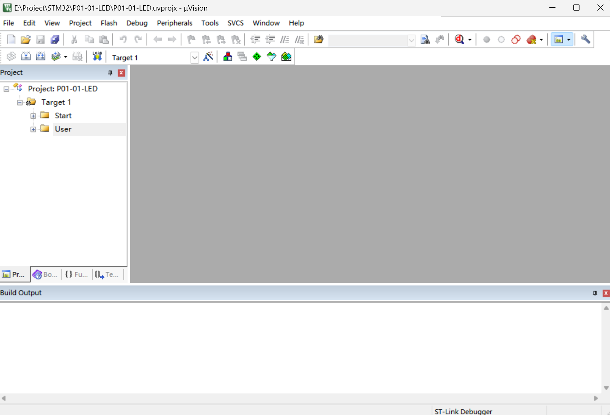
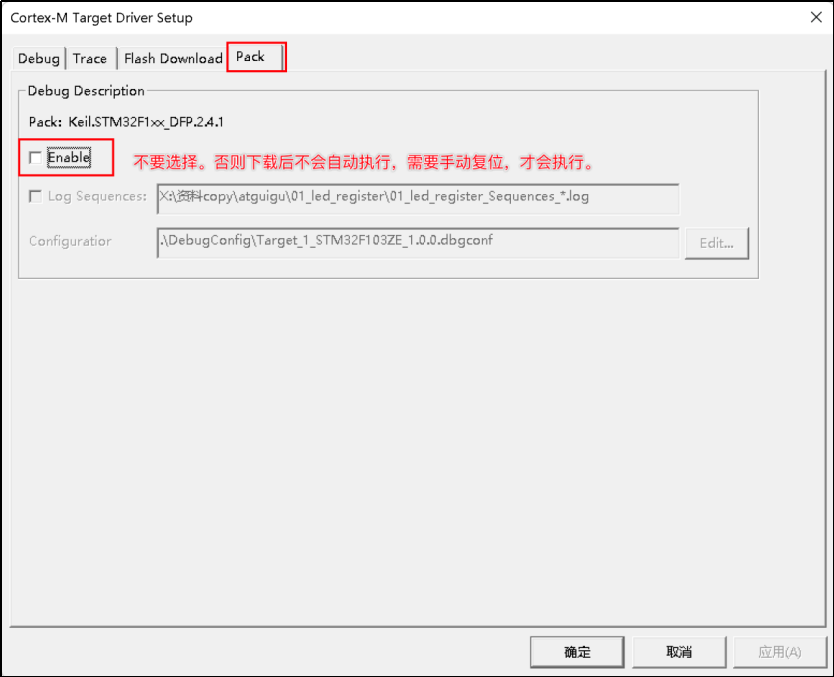

# STM32

## 一、概述

### 1.介绍

​	STM32是ST公司设计的一系列以ARM Cortex-M为核心的32位微控制器。

### 2.命名规则

### 3.开发方式

STM32开发有三种方式：

1. 直接基于寄存器开发

   **缺点：**开发效率低，代码移植不方便

2. 基于标准库函数开发

3. 基于HAL库开发

   屏蔽了几乎所有硬件信息

## 二、开发工具

### 1.Keil MDK

1. 下载MDK

官方下载地址：https://www.keil.com/download/product/

2. 安装芯片支持包

下载完成之后，双击安装即可。成功之后，再创建项目，就可以找到我们想要的芯片了。

### 2.烧录工具

Keil的安装目录下自带了ST-LINK的USB驱动，双击安装即可。

### 3.串口调试工具

SSCOM

## 三、项目工程

### 1.工程配置

1. 创建工程

   ​	

2. 添加启动文件

   标准外设库下载地址：https://www.st.com/zh/embedded-software/stm32-standard-peripheral-libraries/products.html

   

   刚才下载的标准外设库目录，找到我们需要的启动文件和其他核心文件放入工程中的Start文件夹中

   

   

   

   

   

3. Include Paths

   

4. output配置

   

5. 烧录配置

   

   

   

   

   

### 2.编译配置

​	目前最新的Keil ARM用的是Compiler version 6，与前面的core_cm3.c不兼容，所以需要Compiler version 5。

​	下载地址：https://developer.arm.com/downloads/view/ACOMP5

​	把解压后的文件夹名改成ARMCC放入到Keil MDK的安装目录

## 四、Vscode配置

### 1.Keil Assistant

下载插件：

### 2.配置MDK

