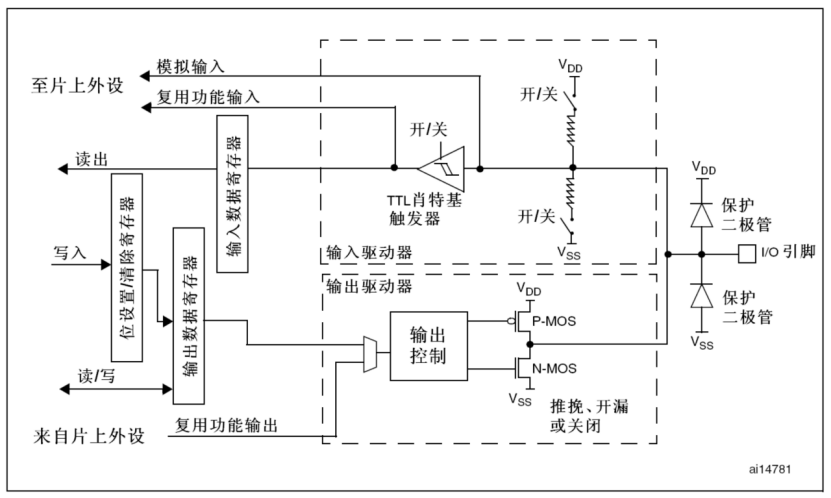
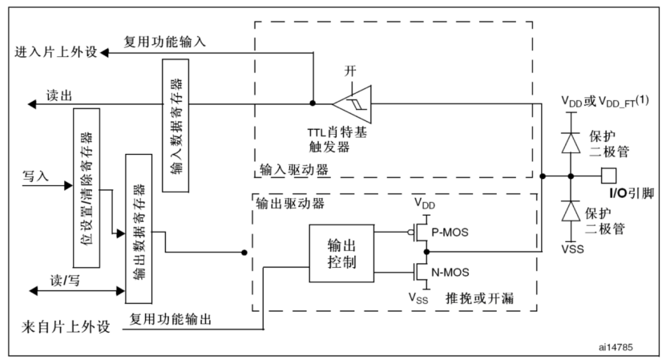
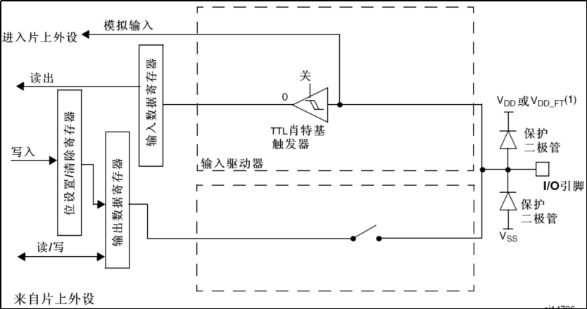
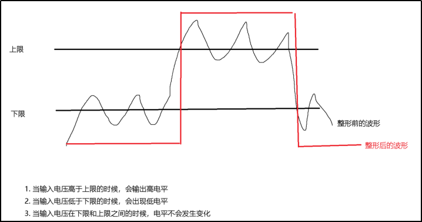

​          

## 一、概述

### 1.介绍

​	GPIO（General-purpose input/output），通用型输入输出。

​	STM32有多组GPIO，比如我们使用的芯片：STM32F103ZET6共有7组GPIO端口，他们分别是GPIOx（x从A-G），每组控制16个引脚，共有112个GPIO引脚。

​	每个引脚的电平是0-3.3V，部分引脚最高可以兼容到5V。

### 2.主要特点

1. 不同型号，IO口的数量可能不一样。
2. 快速翻转。最快可以达到每2个时钟周期翻转一次。（STM32F1系列最快可以达到50MHz的翻转速度）。
3. 每个IO都可以作为外部中断。
4. 支持8种工作模式。

### 3.8种工作模式

GPIO端口的每个位（引脚）可以由软件分别配置成8种模式。

（1）输入浮空（Input floating）

（2）输入上拉（Input pull-up）

（3）输入下拉（Input-pull-down）

（4）模拟输入（Analog）

（5）通用开漏输出（Output open-drain）

（6）通用推挽式输出（Output push-pull）

（7）推挽式复用功能（Alternate function push-pull）

（8）开漏复用功能（Alternate function open-drain）

## 二、工作模式

### 1.输出模式

- 推挽模式：靠P-MOS和N-MOS输出0或1
- 开漏模式：关闭P-MOS。靠上拉电阻将高阻态拉高到1
- 复用推挽模式：引脚和输出寄存器断开，由片上外设控制输出
- 复用开漏模式：引脚和输出寄存器断开，由片上外设控制输出

复用输出模式：

### 2.输入模式

- 输入浮空：上拉下拉电阻关闭

- 上拉输入：上拉电阻打开，默认会输入1

- 下拉输入：下拉电阻打开，默认会输入0

- 模拟输入：

  （1）输出部分被禁止。

  （2）禁止施密特触发输入，实现了每个模拟I/O引脚上的零消耗。施密特触发输出值被强置为0。

  （3）弱上拉和下拉电阻被禁止。

模拟输入：

> [!TIP]
>
> 施密特触发器是包含正反馈的比较器电路，可以对信号进行波形整形。
>
> 

## 三、GPIO相关寄存器

每个GPIO端口有7个相关的寄存器：

（1）2个32位配置寄存器（GPIOx_CRL、GPIOx_CRH）。

（2）2个32位数据寄存器（GPIOx_IDR、GPIOx_ODR）。

（3）1个32位置位/复位寄存器（GPIOx_BSRR）。

（4）1个16位复位寄存器（GPIOx_BRR）。

（5）1个32位锁定寄存器（GPIOx_LCKR）。

