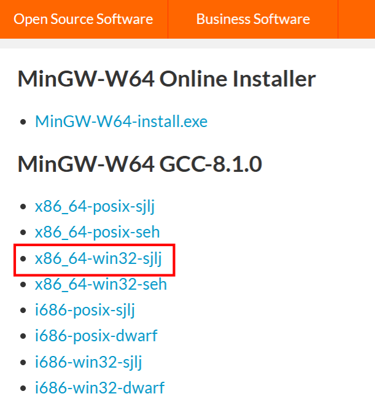

# 环境配置

## 一、MinGW

### 下载安装

C语言的编译器有很多，其中GCC（GNU Compiler Collection）是Linux系统最著名的编译器。MinGW（Minimalist GNU for Windows ）是将Linux中的GCC编译器搬到Windows上，MinGW是一个用于Windows操作系统的开发工具集，其中包含了C语言编译器GCC。

官网地址：https://www.mingw-w64.org

下载地址：[MinGW-w64 ](https://sourceforge.net/projects/mingw-w64/files/mingw-w64/mingw-w64-release/)

- x86_64是指64位的操作系统，i686是指32位的操作系统。现在系统都是64位操作系统，所以选择x86_64。

- win32是开发windows系统程序的协议，posix是其他系统的协议（例如Linux、Unix、Mac OS）。

- 异常处理模型 seh（新的，仅支持64位系统），sjlj （稳定的，64位和32位都支持）， dwarf （优于sjlj的，仅支持32位系统）

下载x86_64-win32-sjlj压缩包并解压便安装完成。

### 配置环境变量

### 测试安装

打开cmd，输入`gcc -v`，如下代表安装完成。

## 二、vscode配置

下载安装vscode，安装插件`C/C++`

编写第一个c程序：

点击运行：

