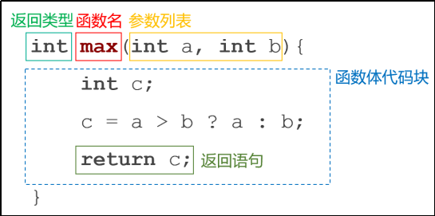
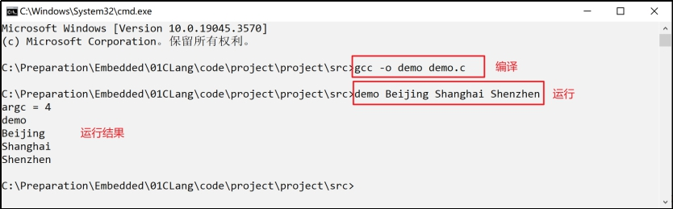
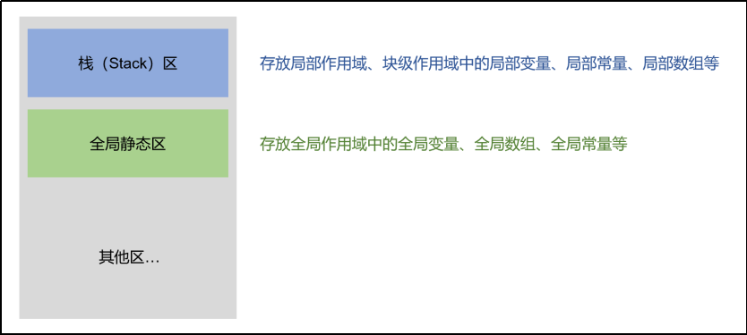
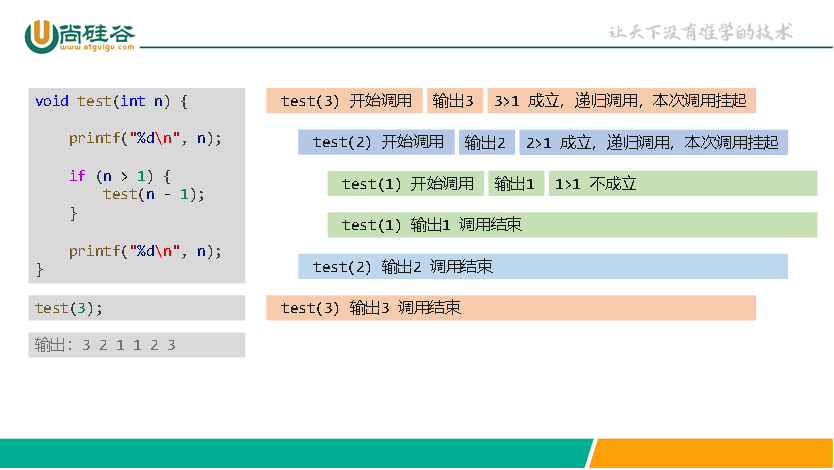

# 函数

## 一、函数概念

### 1.函数介绍

函数是一种可重复使用的代码块，用于执行特定的任务或操作。

函数允许我们将代码逻辑组织成独立的单元，从而提高了代码的可读性、可维护性和重用性。

### 2.函数的作用

1. 封装功能，将一个完整的功能封装成函数，提高代码的结构化和复用性。

2. 代码模块化，将程序按照功能拆分成若干模块单元,有助于降低复杂度。

3. 增强可维护性，如果需要修改某项功能，只需要调整对应的函数代码。

4. 隔离细节，通过函数调用可以隐藏实现细节，只关心输入输出。

### 3.函数的分类

C语言中，从使用的角度分为两种：

1. 库函数，也称为标准函数，是由C系统提供的，用户不必自己定义。
2. 自定义函数，解决具体需求而自己定义的函数，需先定义再使用。

## 二、函数基本语法

### 1.函数的组成部分

```c
返回类型 函数名（参数列表）
{
    函数体语句1;
    函数体语句2;
    … 函数体语句n;
    return 返回值;
}
```



1. 函数名：函数被调用时使用的名字，函数名要符合标识符规范。

2. 函数体：函数中所包含的代码块，用于实现函数的具体功能和操作。

3. 参数：用于接收调用函数时传递进来的值。

4. 返回值：函数执行完毕后，从函数传回到调用点的值，返回值的类型要与函数名前面的返回类型对应。**不写返回值，则返回不确定数**。
5. 返回类型：返回类型**默认不写为int**，没有返回值写 void。

### 2.函数的参数

函数的参数分为形参与实参：

- 形参：在定义函数时，函数名后面括号()中声明的变量称为形式参数，简称形参。

- 实参： 在调用函数时，函数名后面括号()中的使用的常量、变量、表达式称为实际参数，简称实参。

注意：实参的数量要与形参的数量一致，否则报错。

> [!WARNING]
>
> 型参为数组时，其实际为指针！（长度为8）
>
> ```c
> void sum(int arr[])
> {
>   int size = sizeof arr;//不管数组多长，永远为8
> }
> ```
>
> 所以传数组参数时，一定要传数组长度！

## 三、主函数

主函数是程序的入口函数，即所有的程序一定要包含一个主函数，程序总是从这个函数开始执行，如果没有该函数，程序就无法启动。

主函数中可以调用其它函数，但其它函数不能反过来调用主函数，主函数也不能调用自己。

### 主函数返回值

C语言约定，主函数返回值0表示运行成功，如果返回其它非零整数，就表示运行失败。默认情况下，如果主函数里面省略return 0 这一行，编译器会自动加上。

### 主函数参数

主函数的声明中可以带有两个参数，格式如下：

```c
int main(int argc, char *argv[])
{
  // 函数体
}
```

- 形参argc，全称是argument count，表示传给程序的参数个数，其值至少是1；
- 而argv，全称是argument value，argv[]是一个指针数组，数组的每个元素都是字符串。

我们创建一个名为 demo.c 的源文件，代码如下：

```c
#include <stdio.h>

int main(int argc, char *argv[])
{
  printf("argc = %d\n", argc);
  // 函数体
  for (int i = 0; i < argc; i++)
  { 
     printf("%s\n", argv[i]);
  }
  return 0;
}
```

在 demo.c 所在的目录下打开命令行工具，使用 gcc 命令进行编译，如下所示：



## 四、函数原型

​	默认情况下，函数必须先声明，后使用。由于程序总是先运行main() 函数，导致所有其它函数都必须在main() 函数之前声明。

​	如果想将函数声明写在后面，可以在程序开头处给出函数原型。函数原型，就是提前告诉编译器，每个函数的返回类型和参数类型。其它信息都不需要，也不用包括函数体，具体的函数实现可以后面再补上。

```c
#include <stdio.h>

// 使用函数原型进行声明
int twice(int);

// 主函数
int main()
{
    printf("%d\n", twice(100));
    return 0;
}

// 函数定义
int twice(int num)
{
    return 2 * num;
}
```

## 五、作用域

​	作用域用于确定在代码中某个标识符（如变量、标识符常量、数组等）的可见性和访问范围，它决定了在程序的哪些部分可以引用或访问该标识符。

​	作用域可以分为全局作用域、局部作用域、块级作用域。

### 1.全局作用域

在函数和代码块（分支语句、循环语句等）以外定义的变量、标识符常量、数组等具有全局作用域，在程序的任何地方都可以被访问。

对于全局变量，如果没有显式指定初始值，它们将自动**初始化为零值**。

```c
#include <stdio.h>

int a = 1;//全局变量
int main()
{
  printf("%d", a);
}
```

### 2.局部作用域

在函数内定义的变量、标识符常量、数组等具有局部作用域，只有在该函数内部才能被访问。

对于全局变量，如果没有显式指定初始值，它们的值为随机的。

### 3.块级作用域

块级作用域是C99标准引入的概念，在代码块（分支语句、循环语句等）中定义的变量、标识符常量、数组等具有块级作用域，它们也可以被称为局部作用域。

### 4.作用域和内存



- **栈区域**：局部变量、局部数组等通常存储在栈（Stack）区，这些局部数据的内存分配和释放是自动管理的，当函数返回或块级作用域结束时，这些变量的内存会被自动释放。

- **全局静态区域**：全局变量、全局数组等存储在全局静态区，这些全局的数据在程序的整个生命周期内都存在，它们在程序启动时被分配，在程序结束时才被释放。

## 六、static和extern

- static关键字用于修饰变量和函数，可以控制变量和函数的作用范围和生命周期。

- extern关键字用于声明外部链接（本文件之外定义的变量和函数）。

###  ①静态局部变量

1. 作用域仍是所在函数或代码块。
2. 存储在内存的静态区。
3. 生命周期延长至程序结束（下次调用函数略过重新定义）。
4. 不显示初始化赋值，系统自动初始化为0。

### ②静态全局变量

和全局变量特性基本一致，唯一区别是静态全局变量仅对当前文件可见，不能被其他文件访问。

### ③extern

用于声明外部链接。对于外部定义的变量和函数，通过extern声明后就可以使用。

```c
#include <stdio.h>

extern int num;//外部的num变量
extern int sum(int, int);//外部的函数

int main()
{
  printf("%d", num);//使用外部的变量
}
```

### 总结

|              | 可作用范围       | 是否自动初始化 | 内存存储区域 | 生命周期     |
| ------------ | ---------------- | -------------- | ------------ | ------------ |
| 局部变量     | 所在的函数       | 否             | 栈           | 函数调用结束 |
| 静态局部变量 | 所在的函数       | 是             | 静态区       | 程序执行结束 |
| 全局变量     | 全局(整个工程)   | 是             | 静态区       | 程序执行结束 |
| 静态全局变量 | 全局(所在源文件) | 是             | 静态区       | 程序执行结束 |

## 七、递归函数

一个函数体内又调用函数自己，就称为递归函数。

递归函数成功执行必须满足两个条件：

1. 必须有一个明显的结束条件
2. 必须有一个趋近于结束条件的趋势。



## 八、常用系统函数

### 1.字符串相关函数

标准库头文件 `<string.h>`

| 函数              | 说明                                           |
| ----------------- | ---------------------------------------------- |
| strlen(str)       | 返回str的长度（size_t类型）                    |
| strcpy(str1,str2) | 将str2中的字符串复制到str1中（给str1重新赋值） |
| strcat(str1,str2) | 将 str2 中的字符串追加到 str1 后面             |

标准库头文件 `<stdio.h>`

| 函数      | 说明                                                         |
| --------- | ------------------------------------------------------------ |
| sprintf() | 用于将格式化数据写入字符串。相比于 printf()，多了一个参数，第一个参数是要写入的字符串，后面参数与 printf() 一致。简单地讲，sprintf() 是将内容写入字符串而不是输出。 |
| sscanf()  | 用于从一个字符串中按照指定的格式提取数据。相比于 scanf()，多了一个参数，第一个参数是要提取数据的字符串，后面参数与 scanf() 一致。简单地讲，sscanf() 是从字符串中提取数据而不是从用户输入提取数据。 |

### 2.日期相关函数

标准库头文件 `<time.h>`

| 函数                         | 说明                                                         |
| ---------------------------- | ------------------------------------------------------------ |
| time（&变量）                | 获取当前日期赋值到变量中，该变量需是 time_t 类型             |
| ctime（&时间值）             | 将时间戳转为字符串并返回，时间值需是 time_t 类型             |
| difftime（时间值1，时间值2） | 返回两个时间值的差，返回值是 double 类型，时间值需是 time_t 类型 |

> `time_t` 是C语言中用于表示时间值的数据类型，它通常是一个整数类型（`int ``或 long 或 long long`），用于存储时间戳。
>
> 时间戳是指从1970年1月1日（通常称为UNIX纪元）零时零分零秒（UTC时间）起至某一特定时刻所经过的秒数。

### 3.数学相关函数

标准库头文件 `<math.h>`

| 函数     | 说明          |
| -------- | ------------- |
| sqrt(x)  | 计算平方根    |
| cbrt(x)  | 计算立方根    |
| pow(x,y) | 计算x的y次方  |
| fabs(x)  | 计算x的绝对值 |
| ceil(x)  | 向上取整      |
| floor(x) | 向下取整      |
| round(x) | 四舍五入取整  |
| trunc(c) | 截断小数部分  |

> 以上函数参数和返回的都是 double 类型
