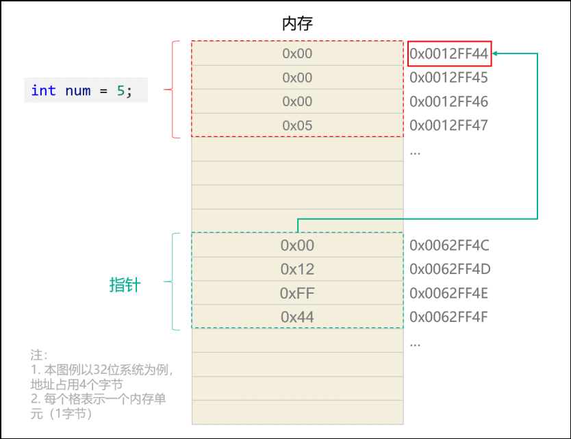
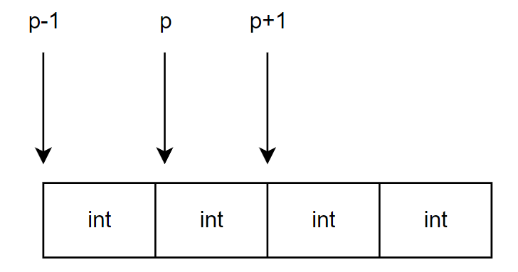
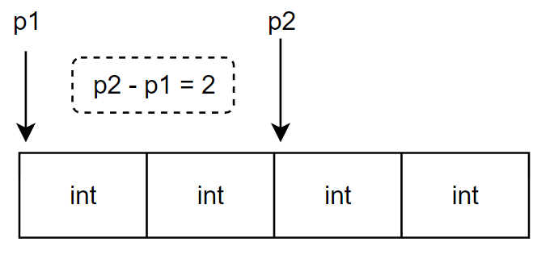

## 一、指针基础

变量有两种访问方式：

1. 直接访问，通过变量名访问
2. 间接访问，通过指针访问

### 1.什么是指针

用于专门存储地址的变量就是指针变量，通常简称指针。



> [!TIP]
>
> 64为系统使用64位表示地址，所以其指针占用8字节。
>
> 32位系统使用32位表示地址，其指针占用4字节。

### 2.指针的定义

一般格式：

```c
数据类型 *标识符 = 地址;
int *num = &a;
```

下面的写法都是合法的：

```c
int *num = &a;
int* num = &a;
int * num = &a;
```

### 3.&和*

- `&`为取地址运算符。
- `*`为取值运算符，作用是取出指针指向的内存地址处的数据值。

```c
int a = 1;
int *num = &a;
printf("%d", *num);
```

## 二、指针运算

### 1.指针加减

指针与整数加减表示指向的地址的位移对应的数据单位，移动多少与指针数据类型有关。

比如`int *p = &a;`，p+1表示地址加4，p-1表示地址减4。



### 2.同类型指针相减

同类型指针相减结果表示地址相差多少个数据单位。高位地址减去低位地址，返回的是正值；低位地址减去高位地址，返回的是负值。

同类型指针相减的结果是一个 ptrdiff_t 类型数据，ptrdiff_t 类型是一个带符号的整数，格式输出中对应的格式占位符是 %td



### 3.指针比较

指针比较是直接比较其指向地址的大小，返回的是int类型1或0。

## 三、指针和数组

### 1.数组名

==数组名在大多数情况下会隐式的转换为第一个元素的指针(唯独sizeof的时候不会转换)。==基本可以当成指针，具有指针的大部分特性。

> `arr[i]`是语法糖，本质就是 `*(arr+i)`的简写。

数组名和指针的区别：

1. 数组名表示符常量，不能改变；指针可以改变。
2. `sizeof 数组名`得到的是整个数组的大小; `sizeof 指针`得到的是指针的大小。

```c
#include <stdio.h>

int print(int arr[])//形参也为地址！
{
  printf("%zu\n", sizeof arr);//8
}
int main()
{
  int arr[3] = {1,2,3};
  int (*p)[3] = arr;

  printf("%zu\n", sizeof arr);//12
  printf("%p\n", arr);//地址
  printf("%p\n", p);//地址
  
  return 0;
}
```

### 2.指针数组

指针数组是一个数组，其每一个元素为指针。

```c
数据类型 *指针数组名[长度];
int *arr[3] = {&a,&b,&c};
```

### 3.数组指针

数组指针是一个指针，其指向一个数组的地址。注意，数组指针指向的是整个数组的地址而不是第一个元素的地址。

```c
数据类型 (*数组指针名)[长度];
int (*p)[3] = &arr;
```

上面的数组指针一个单位数据长度为12，所以p+1表示地址+12。

### 4.字符指针

字符指针变量（简称字符指针）是C语言中的一种指针类型，它用于指向字符或字符串（字符数组），通常用于处理字符串（字符数组）。

```c
char *pStr= "hello tom";
```

指向字符串字面量常量的字符指针的特点：

1. 相对于字符数组名，字符指针可以修改指针，指向新的字符串。
2. 不能通过下标修改某个字符。
3. 字符指针不能接收scanf输入的字符串。

### 总结：

```c
int arr[5] = {10,20,30,40,50};		// arr 数组名
int *ptr = arr;  					// ptr 显式定义的首元素指针
int (*arr_ptr)[5] = &arr;  			// arr_ptr 是数组指针
```

| 标识符  | 性质       | 数据类型   | sizeof 计算结果 | +1 的值              | * 取值（解引用）     | 能否重新赋值(可变性) |
| ------- | ---------- | ---------- | --------------- | -------------------- | -------------------- | -------------------- |
| arr     | 数组名     | int [5]    | 整个数组的大小  | 第二个元素地址       | 首元素值             | 否                   |
| ptr     | 首元素指针 | int *      | 地址大小        | 第二个元素地址       | 首元素值             | 是                   |
| arr_ptr | 数组指针   | int (*)[5] | 地址大小        | 数组后面地址（越界） | 数组名（首元素地址） | 是                   |
