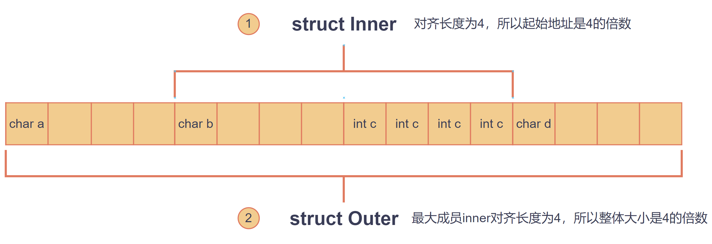

## 一、枚举

枚举（Enumeration）是C语言中的一种用户自定义数据类型，用于定义一组相关的常量。枚举使我们可以为这些常量分配有意义的名字，从而提高代码的可读性和可维护性。

### 1.定义枚举

1. 基本定义

   ```c
   #include <stdio.h>
   
   enum weekday
   {
     MONDAY,
     TUESDAY,
     WEDNESDAY,
     THURSDAY,
     FRIDAY,
     SATURDAY = 888,
     SUNDAY = 666
   };
   int main()
   {
     enum weekday day = MONDAY;
   }
   ```

2. 定义枚举同时声明两个枚举变量

   ```c
   enum weekday
   {
     MONDAY,
     TUESDAY,
     WEDNESDAY,
     THURSDAY,
     FRIDAY,
     SATURDAY,
     SUNDAY
   } day = MONDAY, day2;
   int main()
   {
     printf("%d", day);//0
   }
   ```


3. 省略枚举名称

   ```c
   enum
   {
     MONDAY,
     TUESDAY,
     WEDNESDAY,
     THURSDAY,
     FRIDAY,
     SATURDAY,
     SUNDAY
   } day = MONDAY;

4. 定义局部的枚举类型（只能在局部使用）

   ```c
   int main()
   {
     enum Bool
     {
       FALSE,
       TRUE
     };
   }
   ```

### 2.枚举的特点

（1）枚举元素的值必须在同一枚举中是唯一的
（2）枚举元素的值必须是整数类型，通常是int
（3）如果没有为枚举元素指定值，编译器会自动为它们分配值，从0开始，依次递增。
（4）定义枚举的时候也可以为枚举元素自定义值，需保证唯一性和整型类型。

## 二、结构体

### 1.定义结构体

* 类型名称和成员名称都需要符合标识符规范
* 结构体的成员类型可以是任意类型（整数、浮点、数组、指针、枚举、结构体）

```c
struct 类型名称
{
    成员类型 成员名称;
    成员类型 成员名称;
    成员类型 成员名称;
    成员类型 成员名称;
    成员类型 成员名称;
    ....
};

struct 类型名称 变量名;
```

```c
struct Student
{
  int id;
  char *name;
} s1 = {1,"小明"};
```

### 2.访问结构体成员

```c
printf("%d %s", s1.id, s1.name);
```

使用指针访问（`->`）：

```c
struct Student s2 = {2, "小王"};
struct Student *p = &s2;
printf("%d %s", (*p).id, (*p).name);
printf("%d %s", p->id, p->name); //->是上面访问方式的语法糖
```

### 3.结构体存储大小

- **对齐**：为了提高访问速度，现代计算机体系结构都要==各个类型的变量必须位于特定地址上==。这种做法称为“对齐”。例如，在许多平台上，`int`类型的变量需要从4的倍数地址开始存放。这意味着如果之前有未使用的空间不足以满足下一个成员的对齐需求，则会填充额外的空白字节。
- **基准**：那么每个类型都有一个对齐长度（32位默认限制最大对齐值4字节，windows多为16字节）
  - 没超过限制，对齐长度为类型大小本身。
  - 超过限制，对齐长度为默认对齐长度。
  - ==对齐长度 = 类型大小 < 默认对齐长度 ? 类型大小 : 默认对齐长度==
- 整个结构体对齐长度是最大成员的对齐长度，意味着存储大小为最大对齐长度的整数倍。

例子：

```c
struct Outer
{
  char a;
  struct Inner
  {
    char b;
    int c;
  } inner;
};
```



## 三、共用体

### 1.定义共用体

```c
union 类型名称
{
    成员类型 成员名称;
    成员类型 成员名称;
    成员类型 成员名称;
    ....
}
```

```c
union data
{
    int a;
    double b;
    char c;
};

int main()
{   
    union data d0;
    d0.a = 1;
    d0.c = 'A';//会把a覆盖，d0.a的值变为65
  
    union data d1 = {1};//给第一个成员赋值
    union data d2 = {.b = 3.14};//给成员b赋值

    printf("%d", d0.a);//65
    return 0;
}
```

### 2.访问共用体成员

```c
d0.a;
d0.b;
d0.c;
```

共用体指针访问成员（`->`）

```c
union data *p = &d1;
printf("%d", p->a);//->就是(*p).a的简写语法糖
```

### 3.共用体存储大小

所用成员共同的同一个内存空间，大小为最大成员的大小

## 四、typedef

> **#define 类型别名与 typedef 类型别名的区别：**
>
> ① 执行时机不同：`#define`在预处理阶段执行；`typedef` 在程序运行阶段执行。
>
> ② 类型检查：`#define`只进行简单文本替换不作类型检查；`typedef` 在编译阶段会进行类型检查。
>
> ③ 作用域：#define设置的别名无作用域的概念；`typedef`设置的别名具有作用域。

**用法就是把声明变量名位置换成别名**

#### ① 基本类型别名

```c
typedef unsigned char u8;
typedef unsigned short u16;
typedef unsigned int u32;
typedef unsigned long long u64;
```

#### ② 数组别名

```c
typedef int Int_array[];
typedef double Double_array5[5];
```

#### ③ 函数别名

```c
typedef double Avg_function(int, int);
```

#### ④ 指针别名

```c
// 给指向基本类型数据的指针起别名
typedef int *Int_ptr;
typedef char *String;
// 数组指针起别名
typedef int (*Int_arr_ptr)[];
// 函数指针起别名
typedef double (*Avg_function_ptr)(int, int);
```

#### ⑤ 结构体别名

```c
// 5.1 先定义结构体类型，再取别名
struct User
{
    char *name;
    int age;
};
typedef struct User VipUser;

// 5.2 同时定义结构体类型并取别名
typedef struct Person
{
    char *name;
    int age;
} Person;

// 5.3 同时定义结构体类型并取别名，且省略结构体类型名(强烈推荐！！)
typedef struct
{
    char *name;
    double score;
} Student;
```

#### ⑥ 共用体别名

```c
// 6.1 先定义共用体类型，再取别名
// 6.2 同时定义共用体类型和别名
// 6.3 同时定义共用体类型和别名，省略共用体类型名(强烈推荐)
typedef union
{
    char a;
    double b;
} Score;
```

#### ⑦ 枚举别名

```c
// 7.1 先定义枚举类型，再取别名
// 7.2 同时定义枚举类型和别名
// 7.3 同时定义枚举类型和别名，省略共用体类型名(强烈推荐)
typedef enum 
{
    MALE,
    FEMALE,
    ELSE
} Gender;
```


