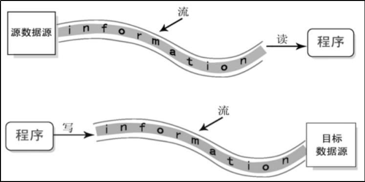
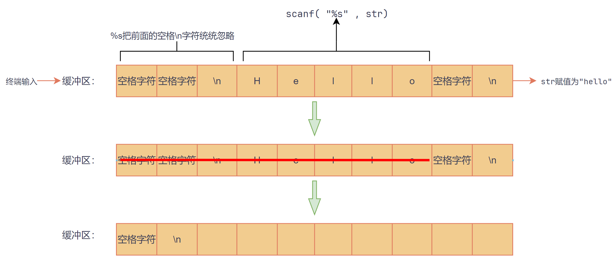

## 一、基本介绍

"Input/Output"简称"IO"，也就是“输入/输出”。

C程序中，数据的输入/输出操作以“流”的方式进行，可以看做是一种数据的流动。

 

**Ø** 输入流（Input Stream）：数据从数据源（例如文件、键盘等）到程序（内存）的传输路径。

**Ø** 输出流（Output Stream）：数据从程序（内存）到数据源（例如文件、屏幕等）的传输路径。

## 二、终端IO

### 终端输入

| 函数                               | 描述                               |
| ---------------------------------- | ---------------------------------- |
| `int scanf(const char *format, …)` | 格式化输入。                       |
| `int getchar(void)`                | 获取单个字符，能获取`\n`和空格字符 |
| `char *gets(char *str)`            | 获取一行字符，能获取`\n`和空格字符 |

使用scanf和getchar多余的字符会残留在缓冲区

==`%s`不能匹配到带有空格和换行符的字符串==



> [!TIP]
>
> 下一个getchar()时，不会等终端输入，会直接获取残留的字符。
>
> 避免残留多余的字符在缓冲区，尤其是\n换行符，可以在格式化字符最后加\n：
>
> ```c
> scanf("%s\n", str);
> ```

### 终端输出

| 函数                                   | 描述                         |
| -------------------------------------- | ---------------------------- |
| `int printf(const char *format, ... )` | 格式化输出。                 |
| `int putchar( int ch)`                 | 输出单个字符。               |
| `int puts( const char *str )`          | 输出字符串，并加一个换行符。 |

## 三、文件IO

### 文件打开关闭

```c
// 打开文件
FILE *fopen( const char *filename, const char *mode );

// 关闭文件
int fclose( FILE *stream );
```

**文件打开模式：**

| 模式 | 含义 |          解释          |   若文件已存在的   | 若文件不存在的 |
| :--: | :--: | :--------------------: | :----------------: | :------------: |
| "r"  | 只读 |     打开文件以读取     |       从头读       |    打开失败    |
| "w"  | 只写 | 创建或打开文件从头写入 |  清空内容并从头写  |   创建新文件   |
| "a"  | 只写 | 创建或打开文件追加写入 |     结尾开始写     |   创建新文件   |
| "r+" | 读写 |    打开文件以读/写     |      从头读写      |    打开失败    |
| "w+" | 读写 | 创建或打开文件以读/写  | 清空内容并从头读写 |   创建新文件   |
| "a+" | 读写 | 创建或打开文件以读/写  |    结尾开始读写    |   创建新文件   |

> **注意：** 每种模式都可以指定文件访问模式标记 "b" 来以二进制模式打开文件。如 `rb`、`wb+`、`b+w`  等

### ② 读文件（输入）

| 函数                                                | 描述                     |
| --------------------------------------------------- | ------------------------ |
| int fscanf( FILE* stream, const char* format, ... ) | 格式化读取文件。         |
| int fgetc( FILE *stream )                           | 从文件读取单个字符。     |
| char* fgets( char *str, int count, FILE *stream )   | 从文件中读取一个字符串。 |

```c
// 1. 格式化读取文件
int fscanf( FILE* stream, const char* format, ... );

// 2. 从文件中读取一个字符
int fgetc( FILE *stream );

// 3. 从文件中读取一个字符串
char* fgets( char *str, int count, FILE *stream );  
    
```

### ③ 写文件（输出）

| 函数                                                | 描述                 |
| --------------------------------------------------- | -------------------- |
| int fprintf(FILE* stream, const char* format, ... ) | 格式化写入文件。     |
| int fputc( int ch, FILE *stream )                   | 写入文件一个字符。   |
| int fputs( const char \*str, FILE* stream )         | 写入文件一个字符串。 |

```c
// 1.格式化写入文件
int fprintf(FILE* stream, const char* format, ... );

// 2.将一个字符写入文件
int fputc( int ch, FILE *stream );

// 3.将一个字符串写入文件
int fputs( const char *str, FILE* stream );  
    
```

