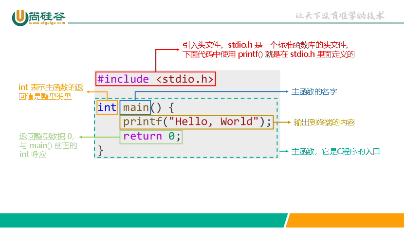
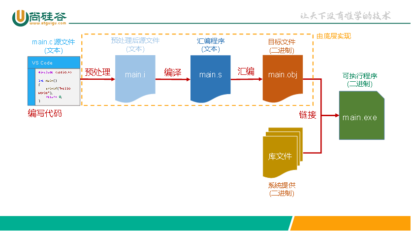

# 程序运行机制流程

## 一、代码解释

```c
#include <stdio.h>//引入标准库

int main()//主函数，是程序执行的入口
{
  printf("hello world");//控制台输出"hello world"
  return 0;//函数返回一个值，通常0代表正常结束，1代表异常结束
}
```



## 二、程序运行流程



1. 编写代码

2. 预处理（`gcc -E main.c -o main.i`）

   去掉空格和注释的文本操作，还有处理预处理指令。生成==.i==后缀的预处理后文件。

3. 编译（`gcc -S main.i -o main.s`）

   将预处理后的文件翻译成汇编代码。生成==.s==后缀的汇编文件。

4. 汇编（`gcc -c main.s -o main.o`）**小写`c`！**

   将汇编文件翻译成机器指令。生成==.o==后缀的目标文件。

5. 链接（`gcc main.o -o main.exe`）

   将多个目标文件合并在一起（其中包含C标准库文件和其他文件）。生成==.exe==后缀的目标可执行程序。
