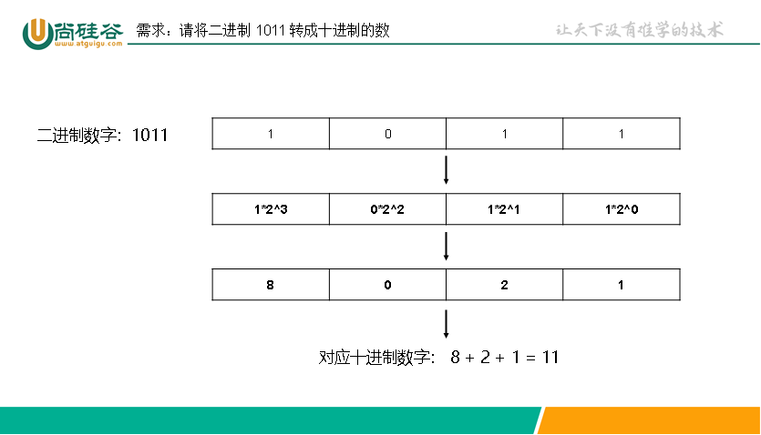
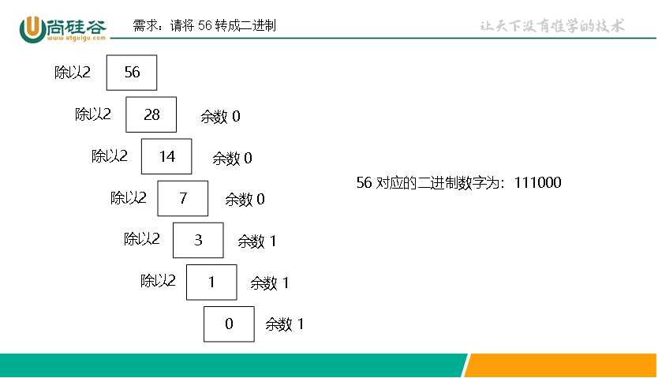
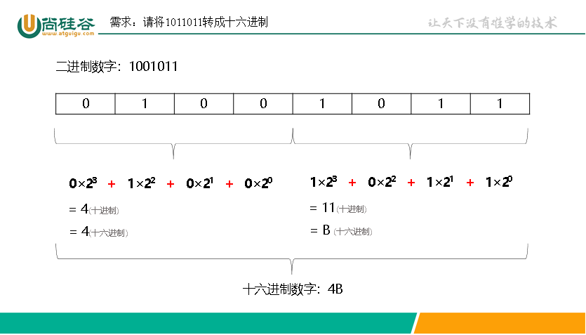
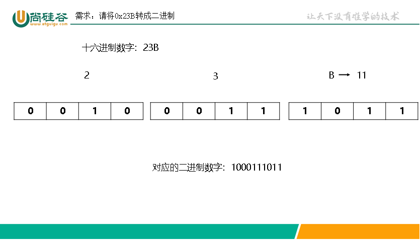
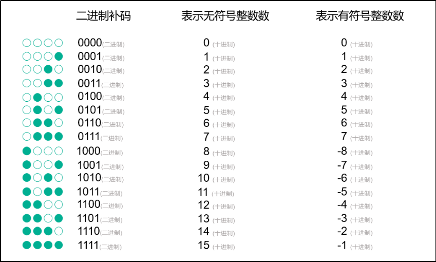

# 进制

1. 二进制：0、1
2. 十进制：0 ~ 9
3. 十六进制：0 ~ 9 、A ~ F

## 一、C语言表示与输出

### 表示

- 二进制：0b或0B开头
- 十进制：正常表示
- 十六进制：0x或0X开头

```c
int a = 0b1011;//二进制
int b = 123;//十进制
int c = 0xAF;//十六进制，af可小写
```

### 输出

占位符：

- 二进制：无（有些编译器可能会有）
- 十进制：%d
- 十六进制：%x、%X、%#x、%#X

```c
printf("%d", 11);
printf("%x", 11);//输出：b
printf('%X', 11);//输出：B
printf('%#x', 11);//输出：0Xb
printf('%#X', 11);//输出：0XB
```

## 二、进制转换

> 进制转换器：https://www.lddgo.net/convert/baseconverter

### 常用2的次方数

```c
2^0 = 1
2^1 = 2
2^2 = 4
2^3 = 8
2^4 = 16
2^5 = 32
2^6 = 64
2^7 = 128
2^8 = 256
2^9 = 512
2^10 = 1024
2^16 = 65536
2^32 = 4,294,967,296
```

### 二进制和十进制

- **二进制 -> 十进制**：每位乘以2的（位数-1）次方，再相加



- **十进制 -> 二进制**：除2取余法



### 二进制和十六进制

- **二进制 -> 十六进制**：4位二进制为一组，表示1位十六进制



- **十六进制 -> 二进制**：1位十六进制，表示4位二进制



## 三、原码、反码、补码

现代计算机的alu只有加法器，所以机器存储的有符号整数都是该数字对应的二进制补码。



> [!TIP]
>
> - 无符号整数没有原码反码补码的概念，原码反码补码只针对有符号整数。
> - 正数的原码反码补码相同，不用转换。

> 补码计算器：https://www.lddgo.net/convert/number-binary-code

### 原码

用第一位表示符号，其余位表示数值。

### 反码

符号位不变，其余为取反

### 补码

反码基础上再加1

