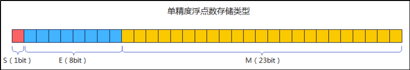
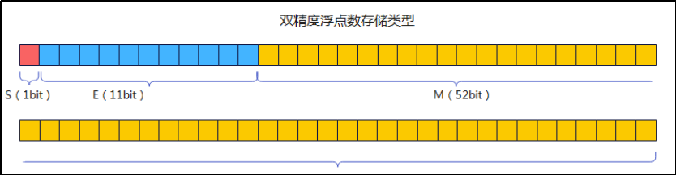

# 数据类型

## 一、数据类型分类

## 二、整数类型

### 八种整型

| 类型                   | 类型简写                    | 说明           | 存储大小（字节）             |
| ---------------------- | --------------------------- | -------------- | ---------------------------- |
| unsigned short int     | unsigned short              | 无符号短整型   | 2字节                        |
| signed short int       | short、signed short         | 有符号短整型   | 2字节                        |
| unsigned int           | unsigned                    | 无符号整型     | 16位：2字节 32位：4字节 |
| signed int             | int、signed                 | 有符号整型     | 16位：2字节 32位：4字节 |
| unsigned long int      | unsigned long               | 无符号长整型   | 16位：4字节 32位：8字节 |
| signed long int        | signed long、long           | 有符号长整型   | 16位：4字节 32位：8字节 |
| unsigned long long int | unsigned long long          | 无符号长长整型 | 8字节                        |
| signed long long int   | signed long long、long long | 有符号长长整型 | 8字节                        |

> [!TIP]
>
> 1. 不同硬件编译平台的类型存储大小和范围为不同
> 2. 4字节int类型范围：-2,147,483,648 (- 2^31) 到 2,147,483,647 (2^31 -1)

### 字面量后缀

| 数据类型  | 字面量后缀 | 数据类型           | 字面量后缀         |
| --------- | ---------- | ------------------ | ------------------ |
| int       | 无         | unsigned int       | U                  |
| long      | L、l       | unsigned long      | UL、ul             |
| long long | LL、ll     | unsigned long long | ULL、LLU、llu、ull |

### 占位符

| 数据类型  | 格式占位符 | 数据类型           | 格式占位符 |
| --------- | ---------- | ------------------ | ---------- |
| int       | %d         | unsigned int       | %u         |
| short     | %hd        | unsigned short     | %hu        |
| long      | %ld        | unsigned long      | %lu        |
| long long | %lld       | unsigned long long | %llu       |

### 精准宽度整数类型

定义在标准库`<stdint.h>`中。精准的字节宽度，提高代码的可移植性

| 类型名称 | 含义            |
| -------- | --------------- |
| int8_t   | 8 位有符号整数  |
| int16_t  | 16 位有符号整数 |
| int32_t  | 32 位有符号整数 |
| int64_t  | 64 位有符号整数 |
| uint8_t  | 8 位无符号整数  |
| uint16_t | 16 位无符号整数 |
| uint32_t | 32 位无符号整数 |
| uint64_t | 64 位无符号整数 |

## 三、浮点类型

| 数据类型    | 说明     | 存储长度                       | 有效小数位数 |
| ----------- | -------- | ------------------------------ | ------------ |
| float       | 单精度   | 4字节                          | 6~9          |
| double      | 双精度   | 8字节                          | 15~18        |
| long double | 长双精度 | 32位：10字节 64位：16字节 | 18及以上     |

> [!TIP]
>
> 1. 浮点类型字面量表示形式：
>    - `0.512`、`.512`（0可以省略）、`5.12e-1`（科学计数法，e代表10）
> 2. 不同硬件编译平台的类型存储大小和范围为不同。

### 字面量后缀

| 类型        | 字面量后缀 |
| ----------- | ---------- |
| float       | F、f       |
| double      | 无         |
| long double | L、l       |

### 占位符

| 类型        | 占位符 | 科学计数法 |
| :---------- | :----- | ---------- |
| float       | %f     | %e         |
| double      | %lf    | %le        |
| long double | %Lf    | %Le        |

### 浮点存储方式

计算机中的浮点分为S、M、E三部分，以科学计数法存储：==(-1)^S^∗M∗2^E^==

其中S是符号位，M是尾数位表示精度（1≤M≤2），E是指数位表示范围。

例如：(−1)^0^∗1.011∗2^2^  |  S = 0，M = 1.011，E = 2

> [!TIP]
>
> IEEE 754规定，在计算机内部保存M时，小数点前默认就是1，因此计算机只保存小数部分
>
> 例如：M = 1.01，计算机中只保存01

