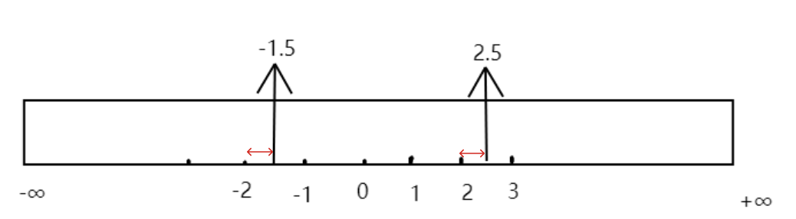

# 运算符

## 7.1 运算符基础

> **运算符：**也称为操作符，是一种特殊的符号，用以用于数据的运算、赋值和比较等。
>
> **运算数：** 也称为操作数，参与运算的数据，可以是变量、常量、表达式。
>
> **表达式：** 表达式具有值，可以是一个变量、一个常量，也可以是变量、常量和运算符的组合。

> **运算符4要素：** 功能、所需操作数个数、所组成表达式的值、有无副作用。
>
> **运算符分类(按操作数个数)：** 一元运算符、二元运算符、三元运算符。
>
> **运算符分类(按功能)：** 算术运算符、关系运算符、逻辑运算符、位运算符、赋值运算符、其他运算符

## 7.2 算术运算符

| 运算符 | 描述         | 操作数个数 | 所组成表达式的值   | 有无副作用 |
| ------ | ------------ | ---------- | ------------------ | ---------- |
| `+`    | 正号         | 1          | 操作数的值         | 无         |
| `-`    | 负号         | 1          | 操作数的值符号取反 | 无         |
| `+`    | 相加         | 2          | 相加的值           | 无         |
| `-`    | 相减         | 2          | 相减的值           | 无         |
| `*`    | 相乘         | 2          | 相乘的值           | 无         |
| `/`    | 相除         | 2          | 相除的值           | 无         |
| `%`    | 取余（取模） | 2          | 余数               | 无         |
| `++`   | 自增         | 1          |                    | 有         |
| `--`   | 自减         | 1          |                    | 有         |

> [!TIP]
>
> 1. 取余（取模）
>    * 表达式的值的符号与第一个操作数保持一致，例如：`10 % -3 = 1`、`-10 % 3 = -1`。
>    * 要求两个操作数必须都是整数。
> 2. C 语言规定，同一个表达中，不允许出现互相影响的带有副作用的子表达式（C 语言标准没有规定各个操作数的计算顺序，由编译器自行实现）。

## 7.2 关系（比较）运算符

| 运算符 | 描述     | 操作数个数 | 所组成表达式的值 | 有无副作用 |
| ------ | -------- | ---------- | ---------------- | ---------- |
| `>`    | 大于     | 2          | 1或0             | 无         |
| `>=`   | 大于等于 | 2          | 1或0             | 无         |
| `<`    | 小于     | 2          | 1或0             | 无         |
| `<=`   | 小于等于 | 2          | 1或0             | 无         |
| `==`   | 相等     | 2          | 1或0             | 无         |
| `!=`   | 不相等   | 2          | 1或0             | 无         |

## 7.3 逻辑运算符

| 运算符 | 描述   | 操作数个数 | 所组成表达式的值                     | 有无副作用 |
| ------ | ------ | ---------- | ------------------------------------ | ---------- |
| `&&`   | 逻辑与 | 2          | 两个条件都成立得1，否则得0           | 无         |
| `||`   | 逻辑或 | 2          | 只要一个条件成立就得1，都不成立得0   | 无         |
| `！`   | 逻辑非 | 1          | 操作数非0表达式得0，操作数0表达式得1 | 无         |

> [!tip]
>
> 逻辑与短路：如果第一个条件不成立，第二个条件将不会执行到。
>
> 逻辑或短路：如果第一个条件就成立，第二个条件将不会比执行。
>
> && 比 || 优先级高：`11 || 12 && 0  == 1`

## 7.4 位运算符

| 运算符 | 描述     | 操作数个数 | 所组成表达式的值 | 有无副作用 |
| ------ | -------- | ---------- | ---------------- | ---------- |
| `&`    | 按位与   | 2          |                  | 无         |
| `|`    | 按位或   | 2          |                  | 无         |
| `^`    | 按位异或 | 2          |                  | 无         |
| `~`    | 按位取反 | 1          |                  | 无         |
| `<<`   | 按位左移 | 2          |                  | 无         |
| `>>`   | 按位右移 | 2          |                  | 无         |

> [!tip]
>
> **按位左移和右移的快捷计算方式**：
>
> 按位左移： $操作数1 \times 2^{操作数2}$  作为表达式的值。
>
> 按位右移：$操作数1 \times 2^{-操作数2}$  作为表达式的值。 
>
> ```c
> printf("%d", -3 >> 1);//-2
> printf("%d", 3 >> 1);//1
> ```
>
> 

> [!WARNING]
>
> 注意按位右移快捷计算方式计算时，计算后打的小数不是简单的舍去小数，而是取比它小的最近的整数。
>
> 


## 7.5 赋值运算符

| 运算符 | 描述         | 操作数个数 | 所组成表达式的值 | 有无副作用 |
| ------ | ------------ | ---------- | ---------------- | ---------- |
| `=`    | 赋值         | 2          |                  | 有         |
| `+=`   | 相加赋值     | 2          |                  | 有         |
| `-=`   | 相减赋值     | 2          |                  | 有         |
| `*=`   | 相乘赋值     | 2          |                  | 有         |
| `/=`   | 相除赋值     | 2          |                  | 有         |
| `%=`   | 取余赋值     | 2          |                  | 有         |
| `&=`   | 按位与赋值   | 2          |                  | 有         |
| `|=`   | 按位或赋值   | 2          |                  | 有         |
| `^=`   | 按位异或赋值 | 2          |                  | 有         |
| `<<=`  | 左移赋值     | 2          |                  | 有         |
| `>>=`  | 右移赋值     | 2          |                  | 有         |

> **注意：**
>
> （1）赋值运算符的第一个操作数（左值）必须是变量的形式，第二个操作数可以是任何形式的表达式。
>
> （2）赋值运算符的副作用针对第一个操作数。

## 7.6 三元运算符

| 运算符 | 描述       | 操作数个数 | 所组成表达式的值                                             | 有无副作用 |
| ------ | ---------- | ---------- | ------------------------------------------------------------ | ---------- |
| `?:`   | 三元运算符 | 3          | 操作数1如果成立，操作数2作为表达式的值<br>操作数1如果不成立，操作数3作为表达式的值 | 无         |

```c
操作数1 ？ 操作数2 : 操作数3
```

## 7.7 其他运算符

| 运算符   | 描述               | 操作数个数 | 所组成表达式的值               | 有无副作用 |
| -------- | ------------------ | ---------- | ------------------------------ | ---------- |
| `sizeof` | 获取数据的存储长度 | 1          | 操作数的存储长度,类型是 size_t | 无         |
| `,`      |                    | 2          | 右边操作数的值作为表达式的值   | 无         |

## 7.8 运算符优先级

- 运算符优先级不用刻意地去记忆，总体上：一元运算符 > 算术运算符 > 关系运算符 > 逻辑运算符 > 三元运算符 > 赋值运算符。 

- 不要过多的依赖运算的优先级来控制表达式的执行顺序，这样可读性太差，尽量使用小括号来控制表达式的执行顺序。

| 优先级 | 运算符   | 名称或含义       | 结合方向 |
| ------ | -------- | ---------------- | -------- |
| **1**  | []       | 数组下标         | 左到右   |
|        | ()       | 圆括号           |          |
|        | .        | 成员选择（对象） |          |
|        | ->       | 成员选择（指针） |          |
| **2**  | -        | 负号运算符       | 右到左   |
|        | （类型） | 强制类型转换     |          |
|        | ++       | 自增运算符       |          |
|        | --       | 自减运算符       |          |
|        | *        | 取值运算符       |          |
|        | &        | 取地址运算符     |          |
|        | !        | 逻辑非运算符     |          |
|        | ~        | 按位取反运算符   |          |
|        | sizeof   | 长度运算符       |          |
| **3**  | /        | 除               | 左到右   |
|        | *        | 乘               |          |
|        | %        | 余数（取模）     |          |
| **4**  | +        | 加               | 左到右   |
|        | -        | 减               |          |
| **5**  | <<       | 左移             | 左到右   |
|        | >>       | 右移             |          |
| **6**  | >        | 大于             | 左到右   |
|        | >=       | 大于等于         |          |
|        | <        | 小于             |          |
|        | <=       | 小于等于         |          |
| **7**  | ==       | 等于             | 左到右   |
|        | !=       | 不等于           |          |
| **8**  | &        | 按位与           | 左到右   |
| **9**  | ^        | 按位异或         | 左到右   |
| **10** | \|       | 按位或           | 左到右   |
| **11** | &&       | 逻辑与           | 左到右   |
| **12** | \|\|     | 逻辑或           | 左到右   |
| **13** | ?:       | 条件运算符       | 右到左   |
| **14** | =        | 赋值运算符       | 右到左   |
|        | /=       | 除后赋值         |          |
|        | *=       | 乘后赋值         |          |
|        | %=       | 取模后赋值       |          |
|        | +=       | 加后赋值         |          |
|        | -=       | 减后赋值         |          |
|        | <<=      | 左移后赋值       |          |
|        | >>=      | 右移后赋值       |          |
|        | &=       | 按位与后赋值     |          |
|        | ^=       | 按位异或后赋值   |          |
|        | \|=      | 按位或后赋值     |          |
| **15** | ,        | 逗号运算符       | 左到右   |