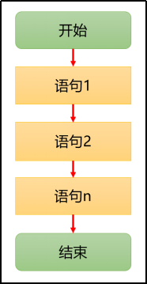

# 流程控制

主要有三大流程控制语句：

1. 顺序控制
2. 分支控制
3. 循环控制

## 1.顺序控制语句

程序从上到下逐行地执行，表达式语句都是顺序执行的。



## 2.分支控制语句

### if else

```c
if (a > 0)
{
	printf("a大于0");
}
else if (a == 0)
{
	printf("a等于0")：
}
else
{
	printf("a小于0");
}
```

### switch

```c
switch (day)
{
	case 1:
	case 2:
	case 3:
	case 4:
	case 5:
		printf("上班");
		break;
	case 6:
	case 7:
		printf("周末happy");
		break;
	default:
		printf("这个星期数不对");
}
```

> [!WARNING]
>
> 1. switch 后面表达式必须是一个整型、字符型或枚举类型。
> 2. case后面的值必须是字面量常量。
>
> 2. 注意加`break;`否则会发生穿透！

