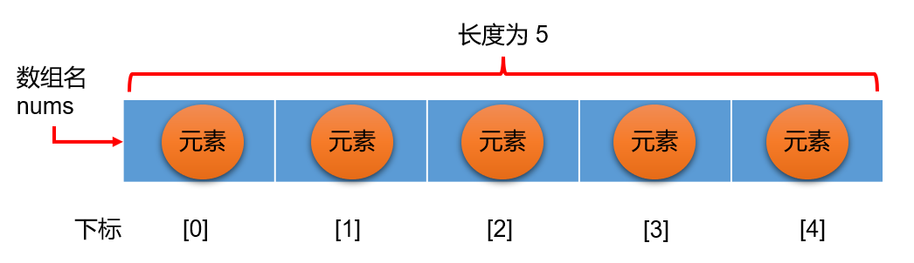

# 数组

## 一、数组的概念

### 1.什么是数组

数组（Array）是多个相同类型的数据顺序排列的集合。数组通过编号（索引、下标）的形式对这些数据进行统一管理。

1. **数组名**：本质是标识符常量，存储的是连续空间的首地址。
2. **元素**：数组中的每个数据成员就叫元素，它们必须是相同的数据类型。
3. **索引**：元素顺序存储的位置编号。
4. **数组长度**：表示元素的个数。



### 2.数组的特点

1. 数组创建时在内存分配一段连续的的地址空间，大小为数组长度×元素类型大小。
2. 数组创建后，其数组本身和长度不能改变。（例如：`int a[2]={1,2}; a={2,3};//报错`）
3. 数组可以通过索引获取对应位置的数据。

## 二、操作数组

### 1.定义数组

数组定义有多种方式：

```c
//第一种。
int arr[3];
arr[0] = 1;
arr[1] = 2;
//第二种。
int arr1[3] = {1, 2, 3};
//第三种，自动推断数组长度。
int arr2[] = {1, 2, 3};
//第四种，给0和5号赋值，并自动推断长度为5 。
int arr3[] ={[0] = 1, [5] = 5};
```

> [!TIP]
>
> - 在全局定义数组，每个元素的默认值为0。
> - 在局部定义的数组，没有初始化（没有赋值），每个元素的默认值为随机。
> - 在局部定义的数组，有初始化（有赋值），元素的默认值为0。
>
> ```c
> #include <stdio.h>
> int a[5];//每个元素的默认值为0
> void main()
> {
> 	int b[5];//每个元素的默认值为随机
> 	int c[5] = {};//元素的默认值为0
> }
> ```

### 2.访问数组

```c
int arr[3] = {1, 2, 3};

printf("索引0位置的元素：%d", arr[0]);
printf("索引1位置的元素：%d", arr[1]);
printf("数组越界", arr[3]);//访问超出数组索引范围的元素叫：数组越界
```

> [!WARNING]
>
> 数组越界：访问超出数组索引范围的元素，可能造成内存安全问题。
>
> C语言不做数组越界的检查，应当在编写时格外注意。

### 3.数组长度

不能在运行时直接获取数组长度，但是我们可以通过sizeof 运算符间接计算出数组长度

```c
int arr[3] = {1, 2, 3};
printf("%zu", sizeof arr / sizeof (int));
printf("%zu", sizeof arr / sizeof arr[0]);
```

### 4.遍历数组

```c
int arr[5] = {1,2,3,4,5};
int len = sizeof arr / sizeof arr[0];
for (int i = 0; i < len; i++)
{
  printf("%d,", arr[i]);
}
```

## 三、字符数组

### 1.字符数组介绍

- 用来存放字符的数组称为字符数组，也可以称为字符串。字符串的输入输出格式占位符是 %s。
- 字符串结尾，会自动添加一个 \0（字符编码为0的字符，表示空字符） 作为字符串结束的标志，所以字符数组最后一个元素必须是 \0。

### 2.字符数组定义

下面三种定义方式等效。

```c
char str[] = {'h', 'e', 'l', 'l', 'o', '\0'};
char str[6] = {'h', 'e', 'l', 'l', 'o'};//初始化，没有赋值的元素默认是0，所以str[5] = '\0'
char str[] = {"hello"};//末尾自动加'\0'
char str[] = "hello";//末尾自动加'\0'
```

### 3.字符数组长度

- 字符数组同样可以用sizeof计算长度

- strlen()函数位于标准库文件<string.h>，可以计算从第一个字符到第一个`\0`字符的长度（不包含`\0`字符）           。

  ```c
  char str[] = "hello";
  printf("%zu", sizeof str);//6
  printf("%zu", strlen(str));//5
  ```

### 4.字符数组遍历

%s占位符：专门输出字符串。其可以等效为下面的for遍历输出

```c
char str[] = "hello";

for(int i = 0; i < strlen(str); i++)
{
  printf("%c", str[i]);  
}

printf("%s", str);
```

